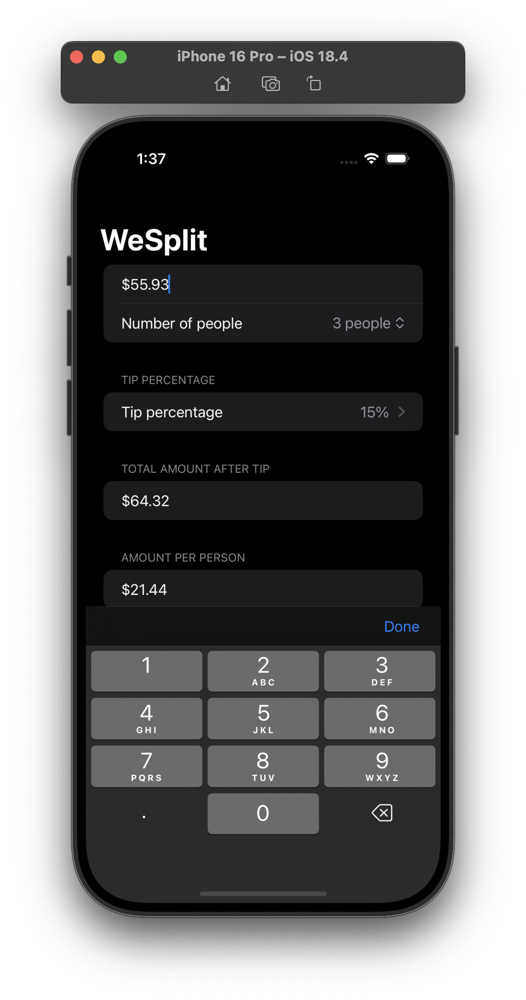
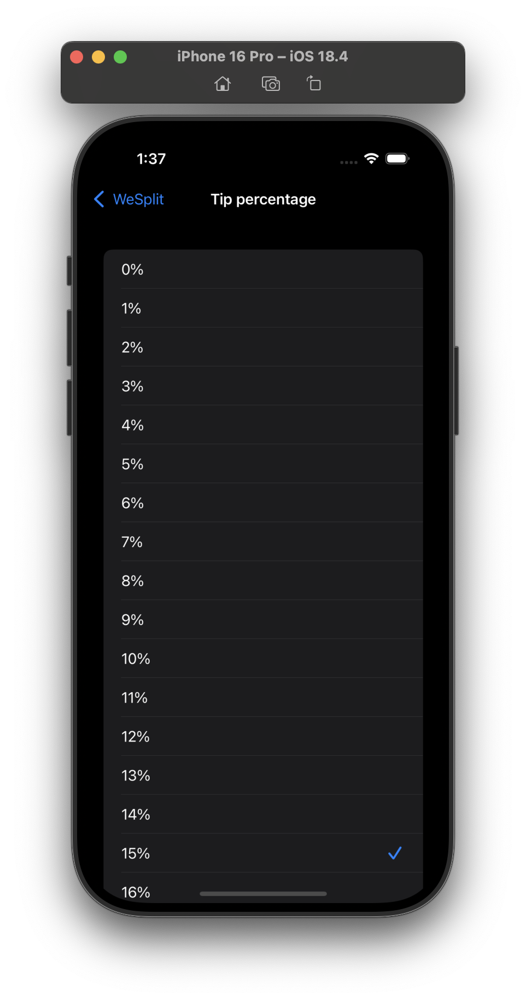

# Project 1 - WeSplit

## Challenges

<!-- prettier-ignore -->
| Challenge | Status |
| --- | :---: |
| 1. Add a header to the third section, saying “Amount per person”. | ✅ |
| 2. Add another section showing the total amount for the check – i.e., the original amount plus tip value, without dividing by the number of people. | ✅ |
| 3. Change the tip percentage picker to show a new screen rather than using a segmented control, and give it a wider range of options – everything from 0% to 100%. | ✅ |

## Screenshots

### Light Mode

  
  
  
  

### Dark Mode

  
  
  
  

## Additional Notes

- Screenshot 4 includes a feature that was added from the Project 3 challenges.
