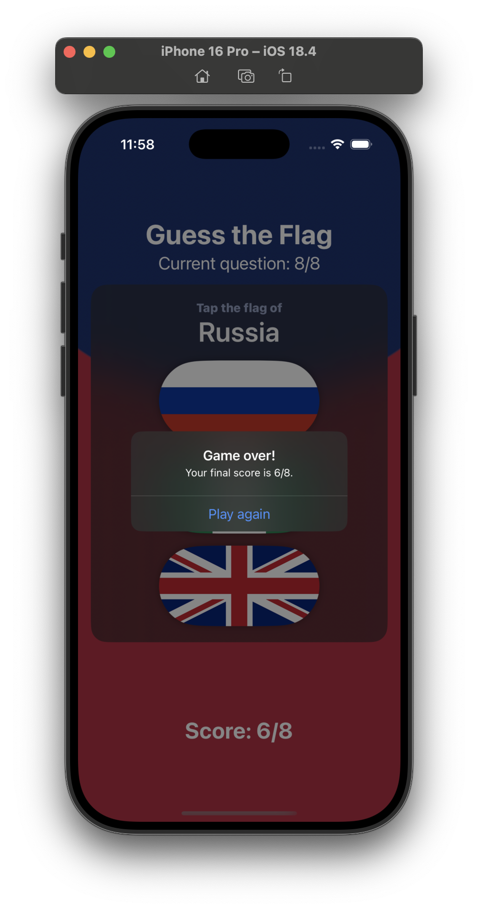

# Project 2 - Guess the Flag

## Challenges

<!-- prettier-ignore -->
| Challenge | Status |
| --- | :---: |
| 1. Add an `@State` property to store the user’s score, modify it when they get an answer right or wrong, then display it in the alert and in the score label. | ✅ |
| 2. When someone chooses the wrong flag, tell them their mistake in your alert message – something like “Wrong! That’s the flag of France,” for example. | ✅ |
| 3. Make the game show only 8 questions, at which point they see a final alert judging their score and can restart the game. | ✅ |

## Screenshots

### Light Mode

  
  
  
  

### Dark Mode

  
  
  
  

