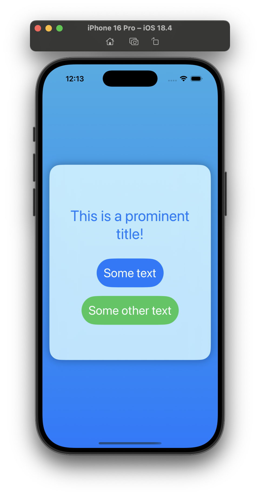
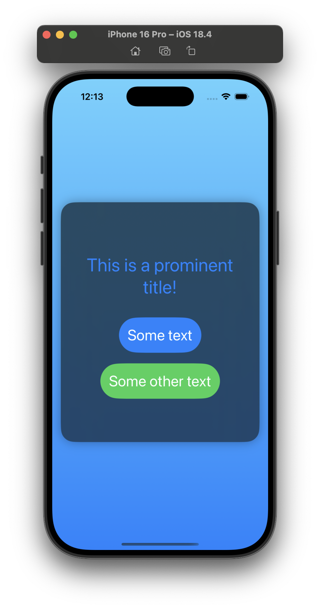

# Project 3 - Views and Modifiers

## Challenges

<!-- prettier-ignore -->
| Challenge | Status |
| --- | :---: |
| 1. Go back to [project 1](../01-Project-1-WeSplit) and use a conditional modifier to change the total amount text view to red if the user selects a 0% tip. | ✅ |
| 2. Go back to [project 2](../03-Project-2-GuessTheFlag) and replace the `Image` view used for flags with a new `FlagImage()` view that renders one flag image using the specific set of modifiers we had. | ✅ |
| 3. Create a custom `ViewModifier` (and accompanying `View` extension) that makes a view have a large, blue font suitable for prominent titles in a view. | ✅ |

## Screenshots

### Light Mode

  

### Dark Mode

  

## Additional Notes

- The screenshot for the Project 1 - WeSplit challenge is in the respective project directory.
