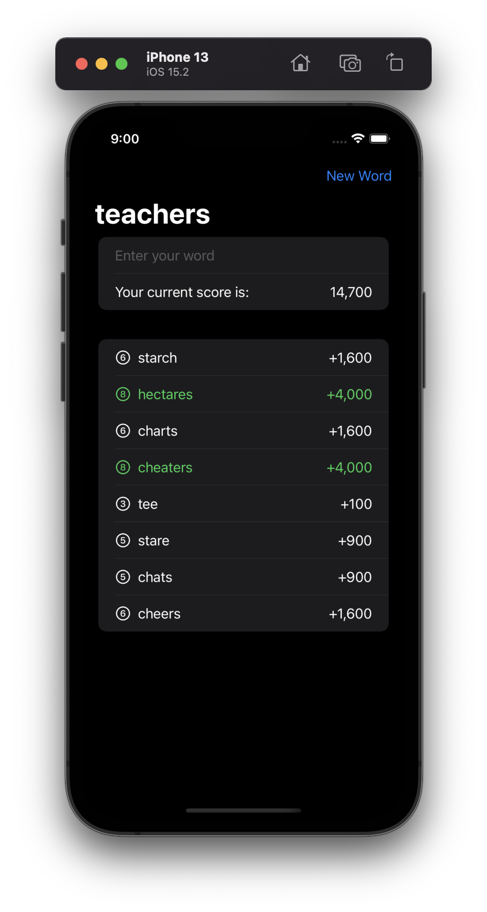
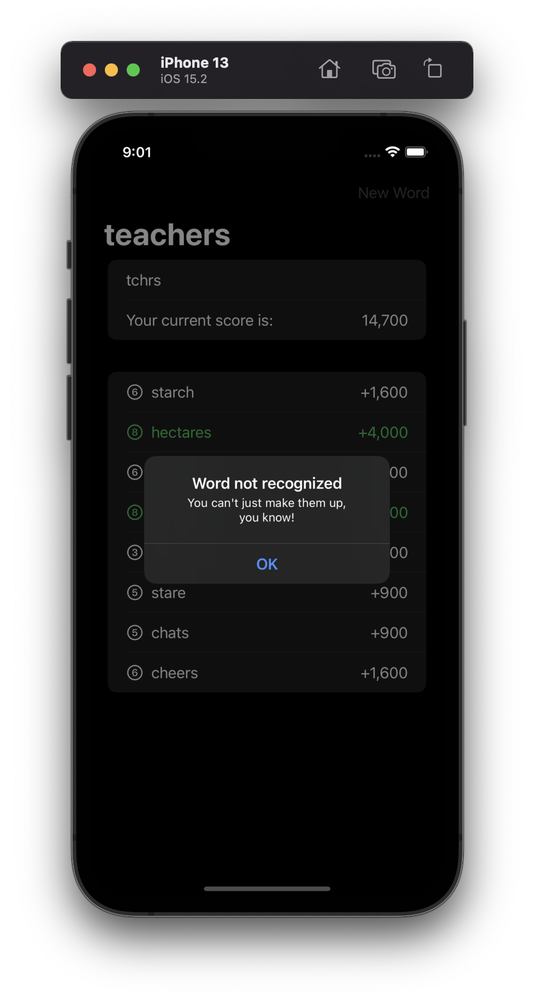

# Project 5 - Word Scramble

This project includes solutions to the challenges.

## Challenges

1. Disallow answers that are shorter than three letters or are just our start word.
2. Add a toolbar button that calls `startGame()`, so users can restart with a new word whenever they want to.
3. Put a text view somewhere so you can track and show the player’s score for a given root word. How you calculate score is down to you, but something involving number of words and their letter count would be reasonable.

## Screenshots

### Light Mode

  
  
  
  
  
  

### Dark Mode

  
  
  
  
  
  

