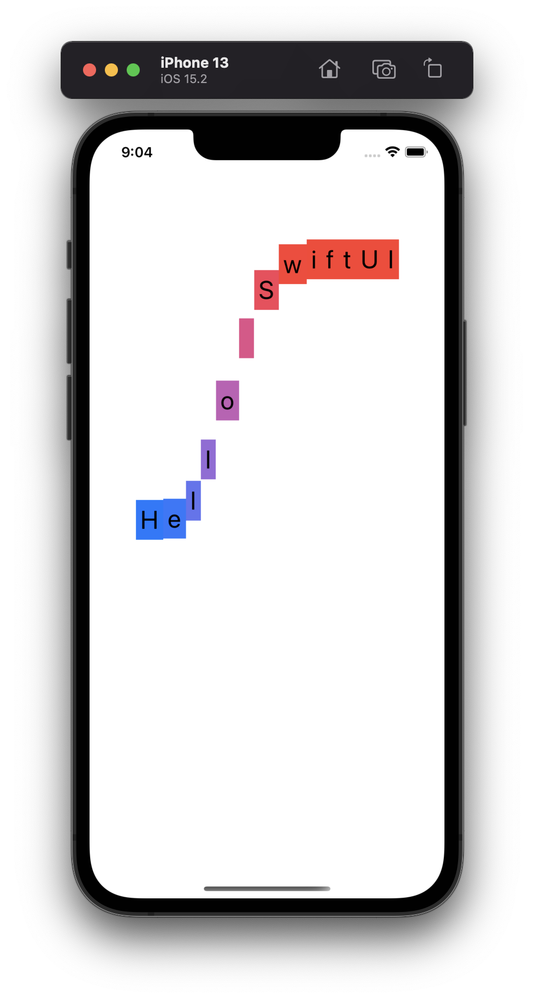
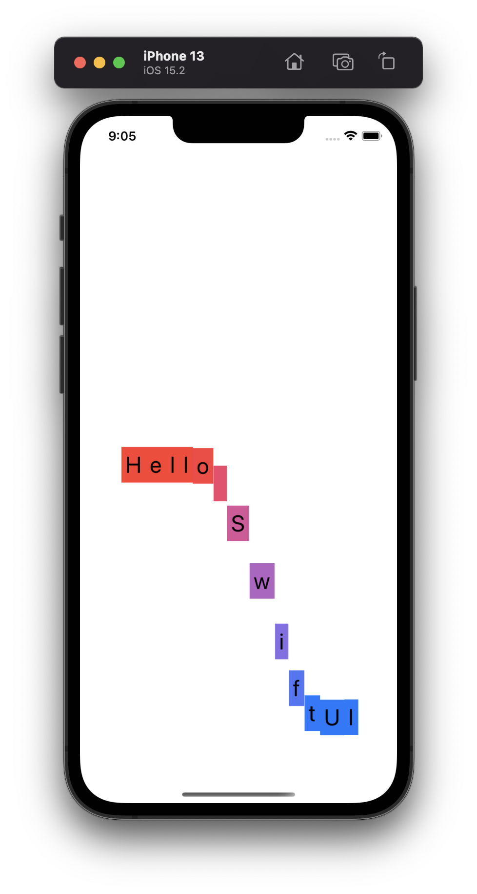
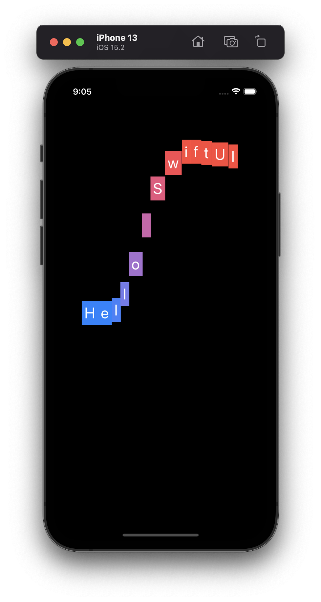
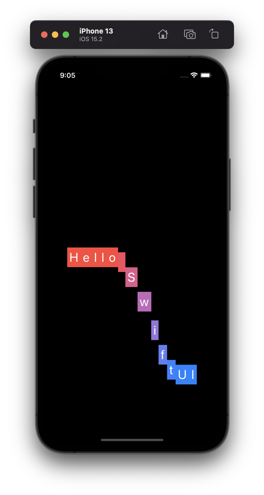

# Project 6 - Animations

This project includes solutions to the challenges.

## Challenges

Go back to the [Guess the Flag](../03-Project-2-GuessTheFlag) project and add some animation:

1. When you tap a flag, make it spin around 360 degrees on the Y axis.
2. Make the other two buttons fade out to 25% opacity.
3. Add a third effect of your choosing to the two flags the user didn’t choose – maybe make them scale down? Or flip in a different direction? Experiment!

## Screenshots

### Light Mode

  
  

### Dark Mode

  
  

