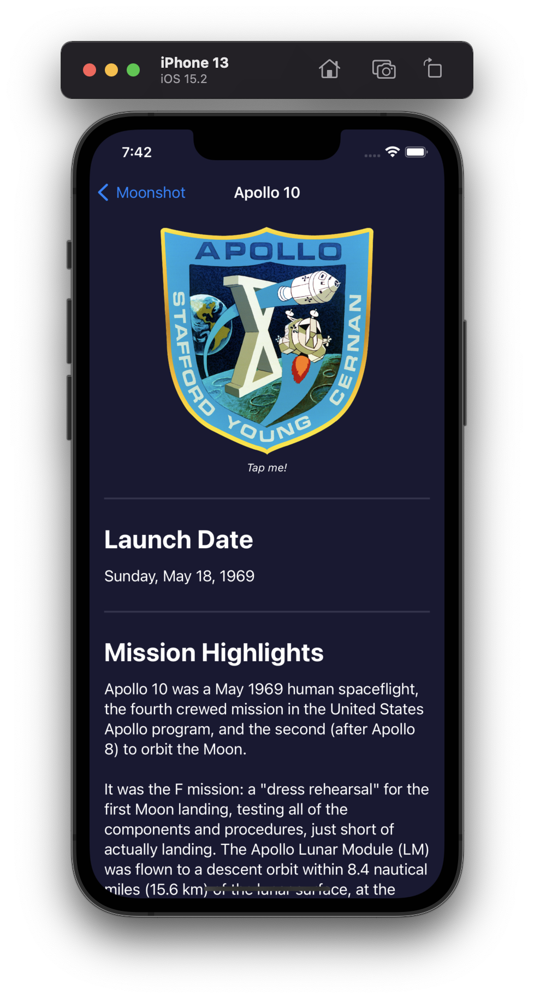
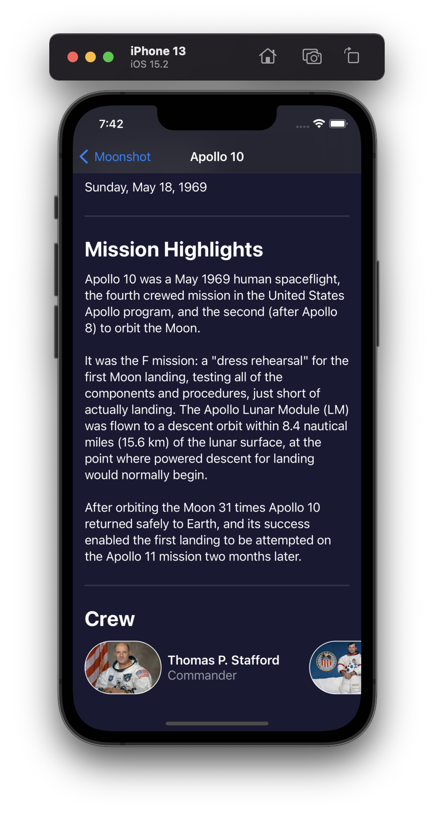
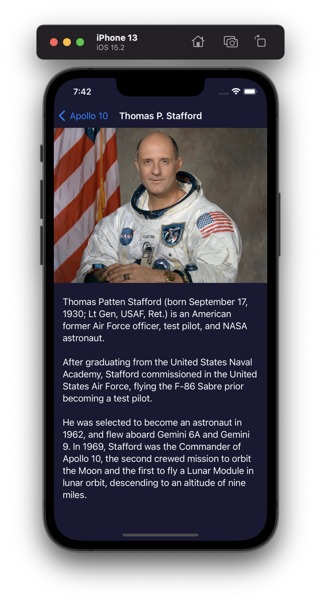

# Project 8 - Moonshot

This project includes solutions to the challenges.

I also added an animation to spin the Apollo mission logos in the MissionView.

## Challenges

1. Add the launch date to `MissionView`, below the mission badge. You might choose to format this differently given that more space is available, but it’s down to you.
2. Extract one or two pieces of view code into their own new SwiftUI views – the horizontal scroll view in `MissionView` is a great candidate, but if you followed my styling then you could also move the `Rectangle` dividers out too.
3. For a tough challenge, add a toolbar item to `ContentView` that toggles between showing missions as a grid and as a list.

## Screenshots

### Light Mode & Dark Mode (Prefers Dark Mode)

  
  
  
  
  

