# Project 9 - Drawing

## Challenges

<!-- prettier-ignore -->
| Challenge | Status |
| --- | :---: |
| 1. Create an `Arrow` shape – having it point straight up is fine. This could be a rectangle/triangle-style arrow, or perhaps three lines, or maybe something else depending on what kind of arrow you want to draw. | ✅ |
| 2. Make the line thickness of your `Arrow` shape animatable. | ✅ |
| 3. Create a `ColorCyclingRectangle` shape that is the rectangular cousin of `ColorCyclingCircle`, allowing us to control the position of the gradient using one or more properties. | ✅ |

## Screenshots

### Light Mode

  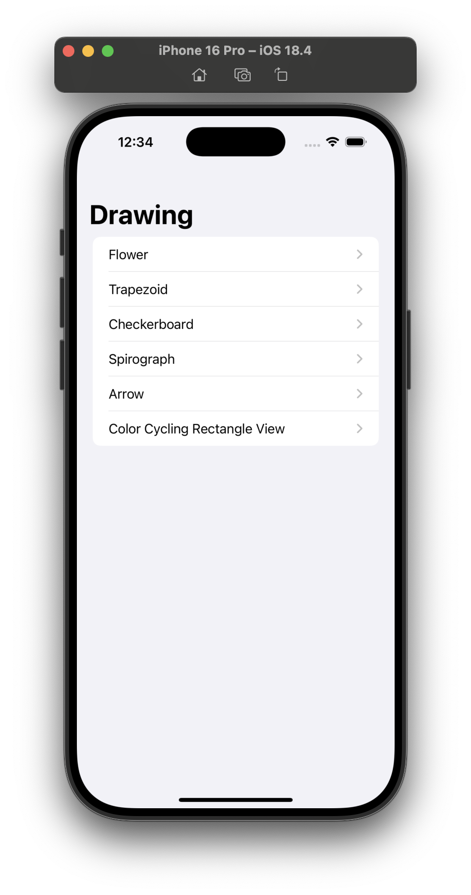
  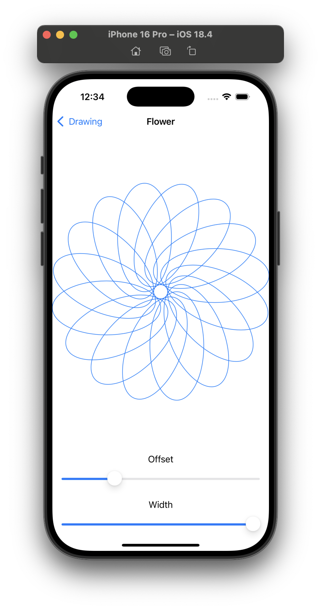
  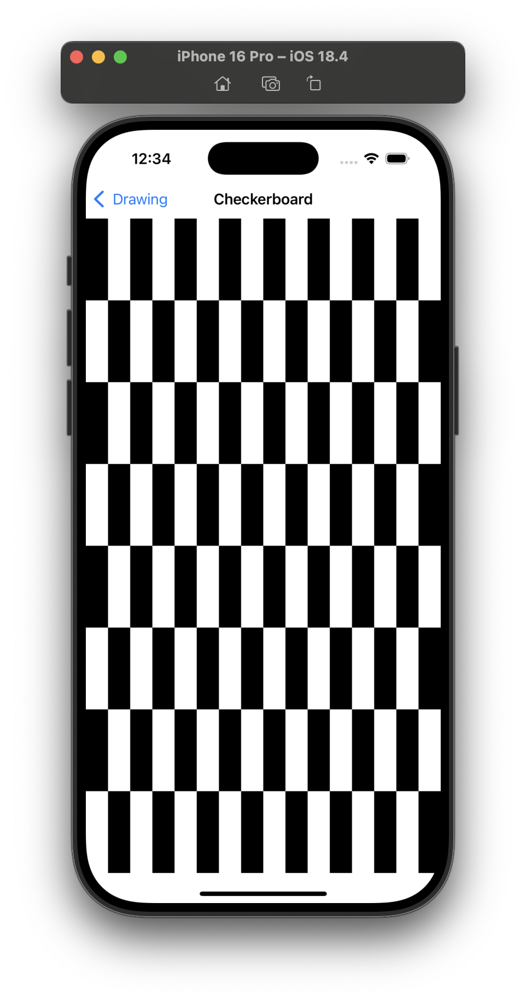
  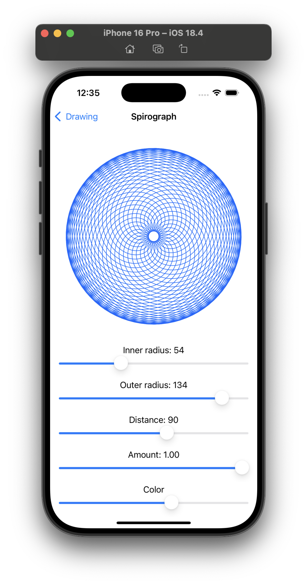
  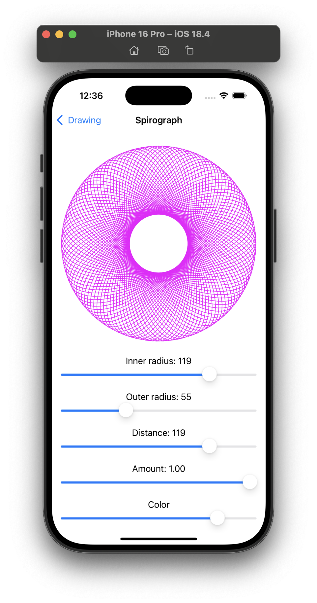
  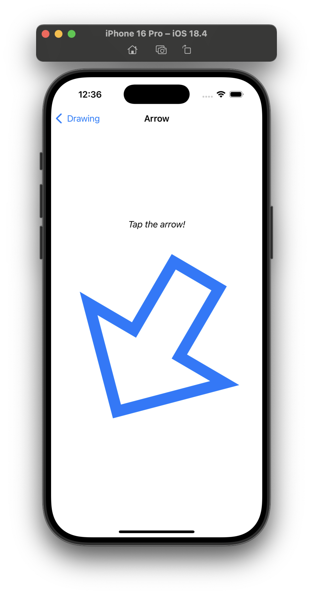
  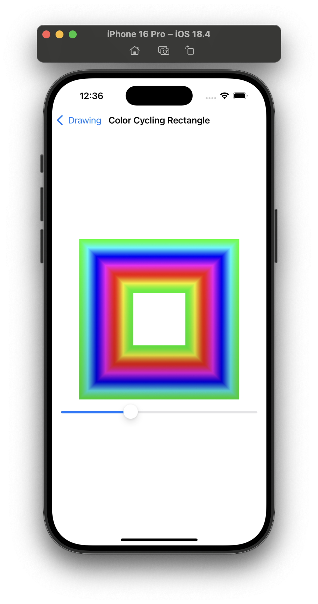

### Dark Mode

  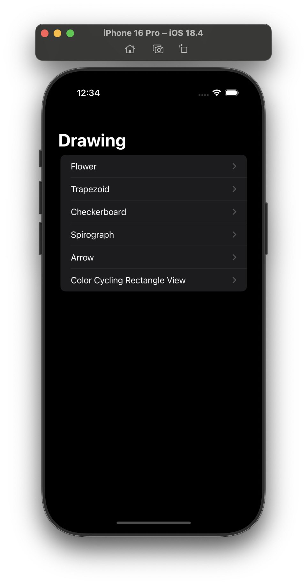
  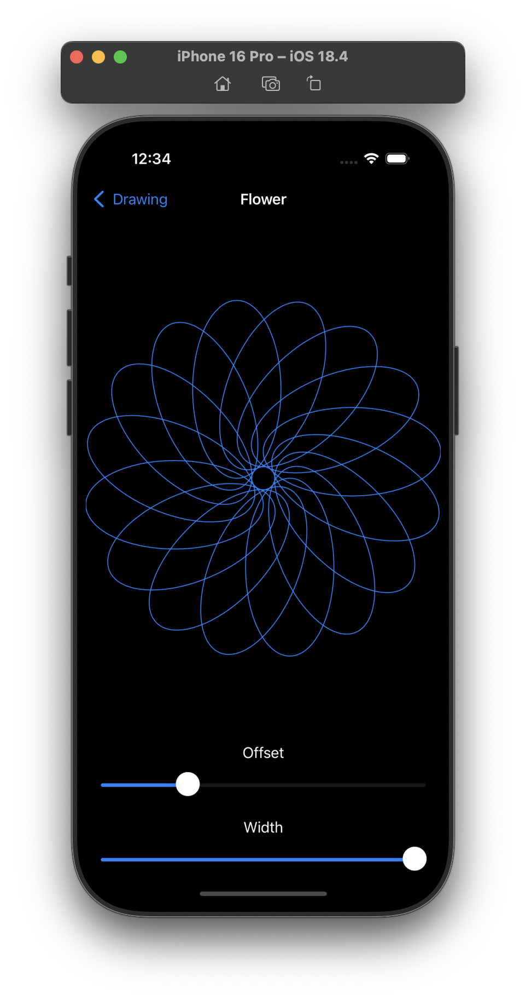
  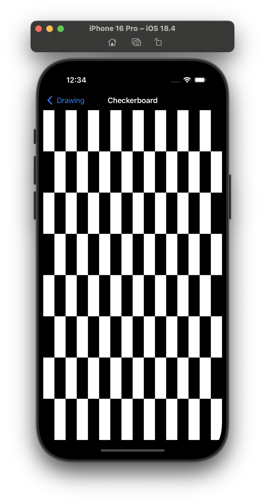
  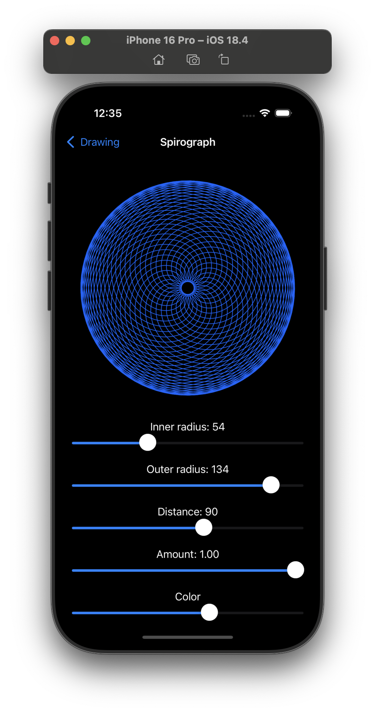
  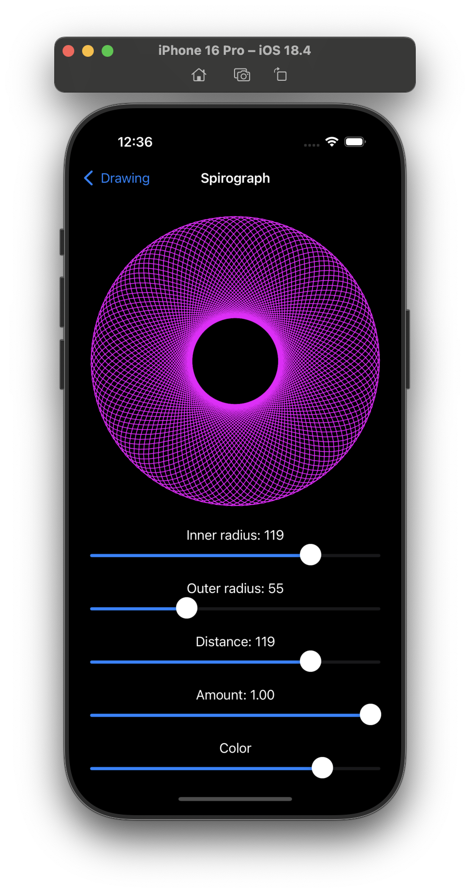
  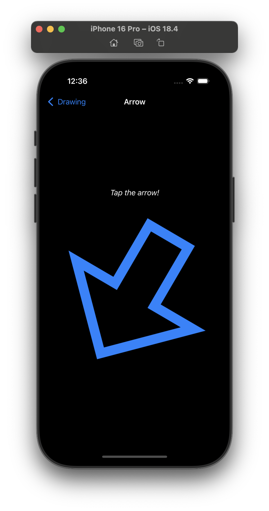
  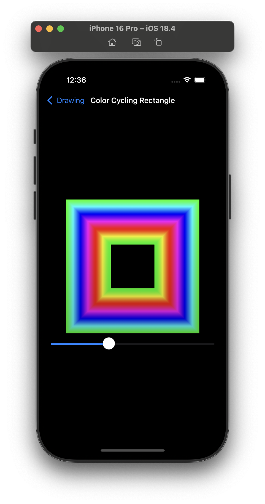

