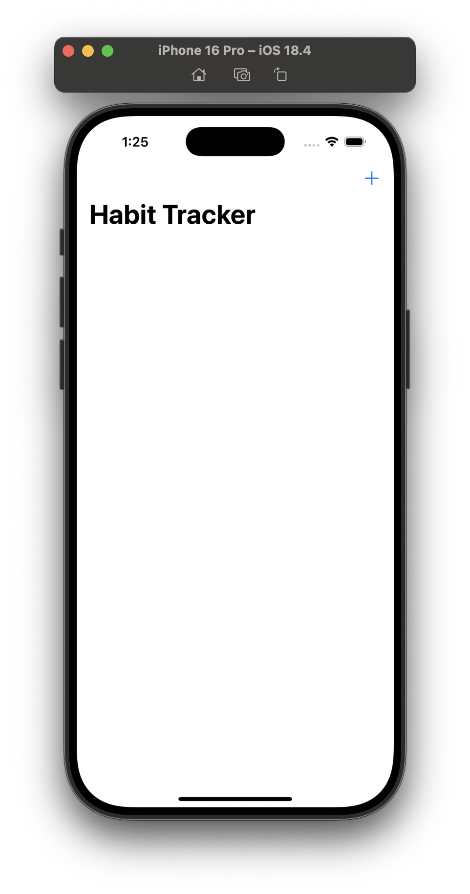

# Milestone Project - Habit Tracker (Projects 7-9)

> This time your goal is to build a habit-tracking app, for folks who want to keep track of how much they do certain things. That might be learning a language, practicing an instrument, exercising, or whatever – they get to decide which activities they add, and track it however they want.
>
> At the very least, this means there should be a list of all activities they want to track, plus a form to add new activities – a title and description should be enough.
>
> For a bigger challenge, tapping one of the activities should show a detail screen with the description. For a tough challenge – see the hints below! – make that detail screen contain how many times they have completed it, plus a button incrementing their completion count.
>
> And if you want to make the app really useful, use Codable and UserDefaults to load and save all your data.

## Screenshots

### Light Mode

  
  
  
  

### Dark Mode

  
  
  
  

