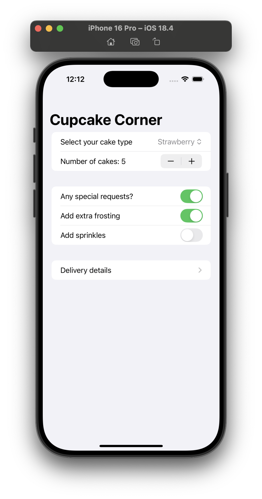
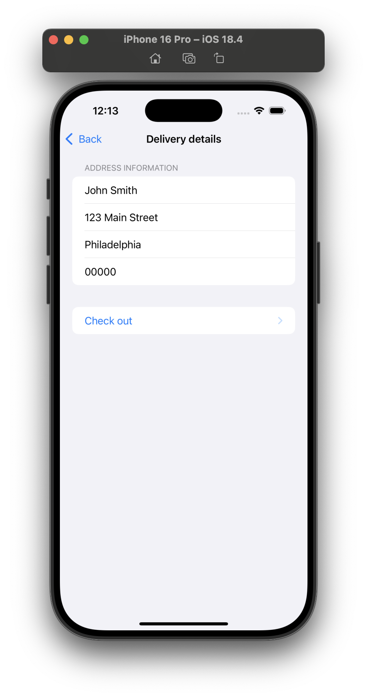
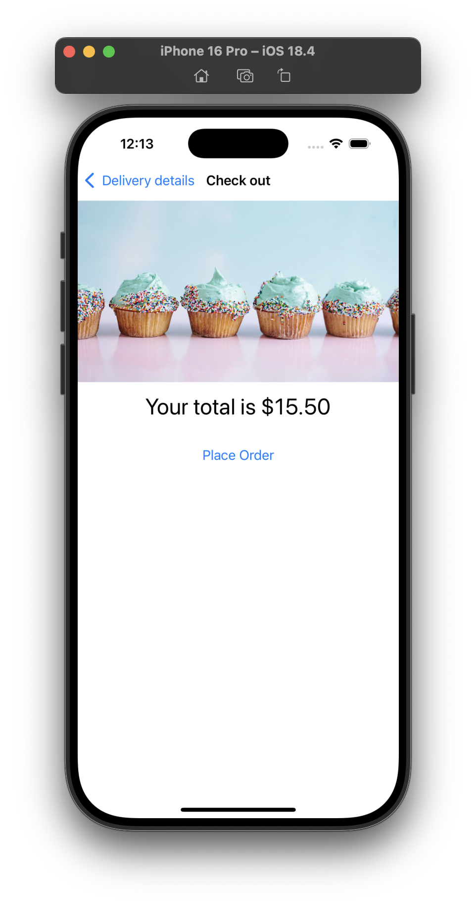
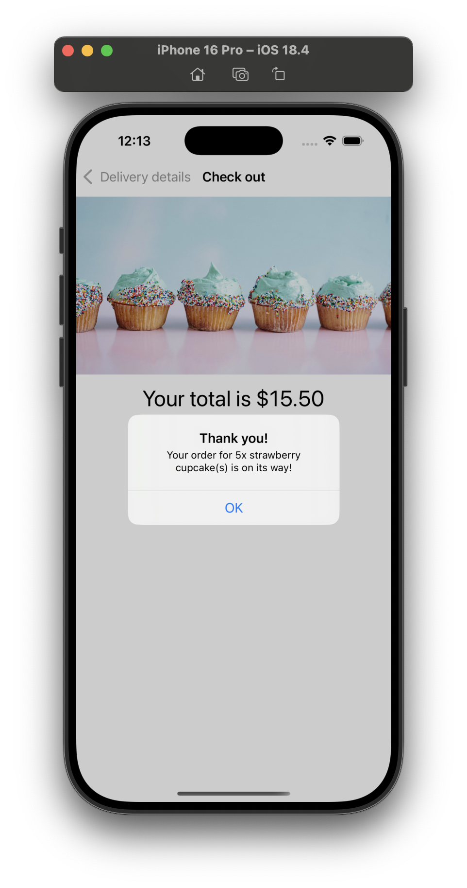
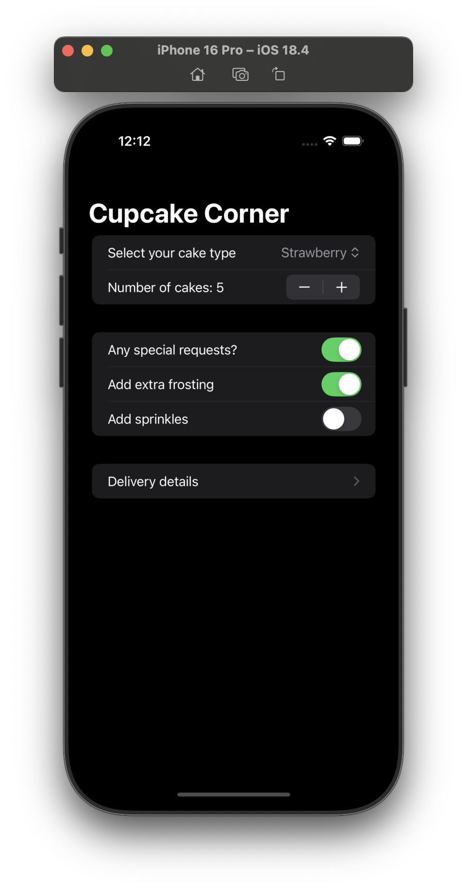
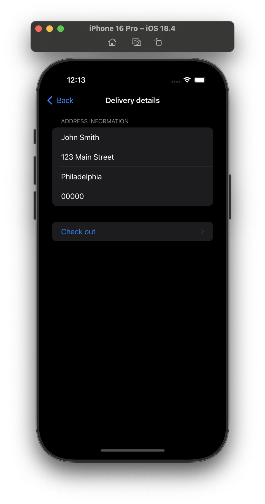
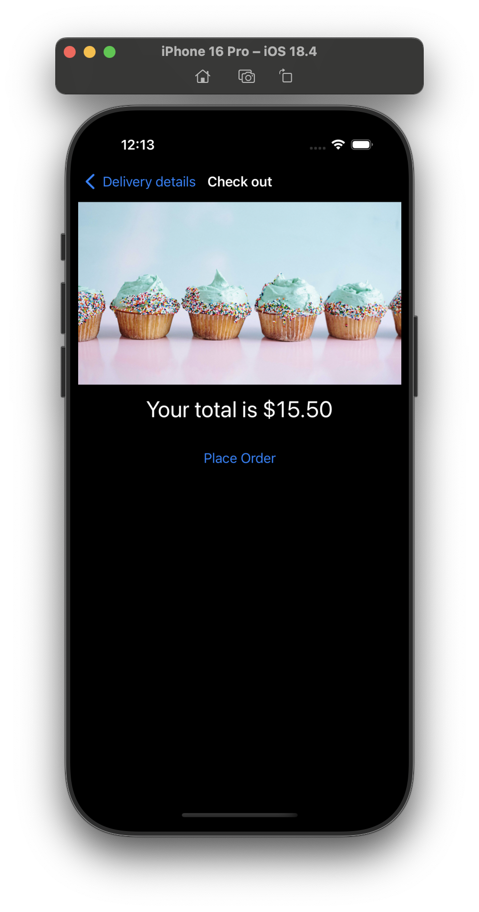
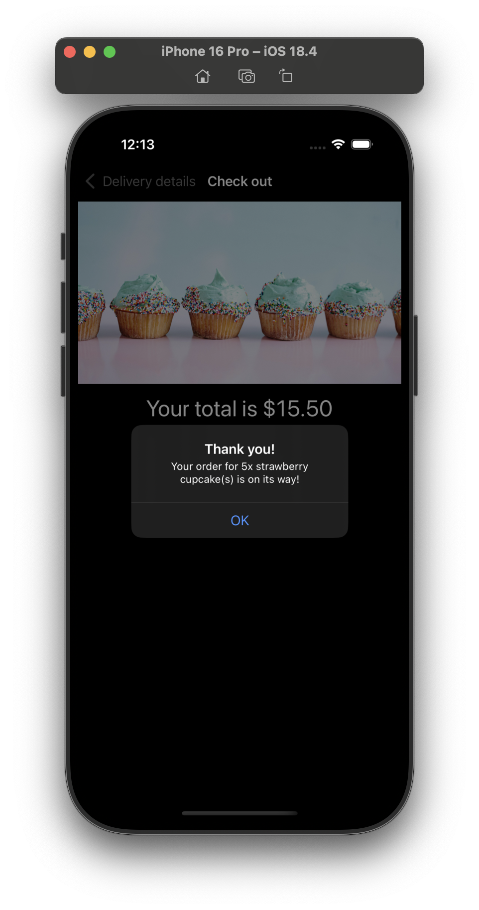

# Project 10 - Cupcake Corner

## Challenges

<!-- prettier-ignore -->
| Challenge | Status |
| --- | :---: |
| 1. Our address fields are currently considered valid if they contain anything, even if it’s just only whitespace. Improve the validation to make sure a string of pure whitespace is invalid. | ✅ |
| 2. If our call to `placeOrder()` fails – for example if there is no internet connection – show an informative alert for the user. To test this, try commenting out the `request.httpMethod = "POST"` line in your code, which should force the request to fail. | ✅ |
| 3. For a more challenging task, see if you can convert our data model from a class to a struct, then create an `ObservableObject` class wrapper around it that gets passed around. This will result in your class having one `@Published` property, which is the data struct inside it, and should make supporting `Codable` on the struct much easier. | ✅ |

## Screenshots

### Light Mode

    
    
    
    

### Dark Mode

    
    
    
    

