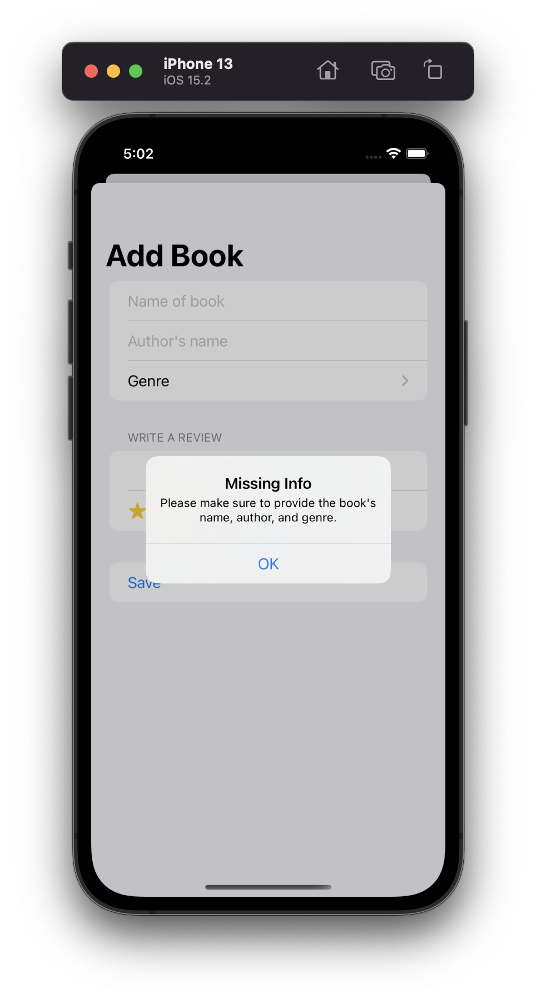
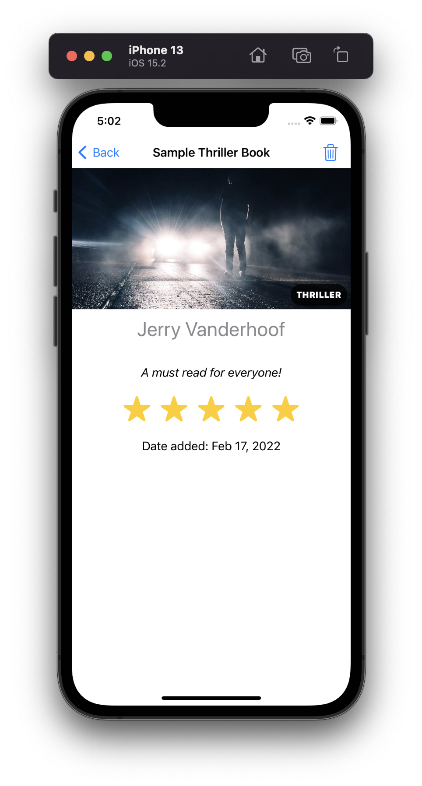
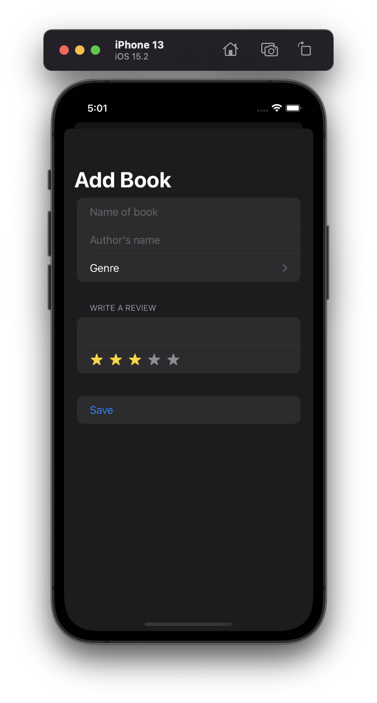
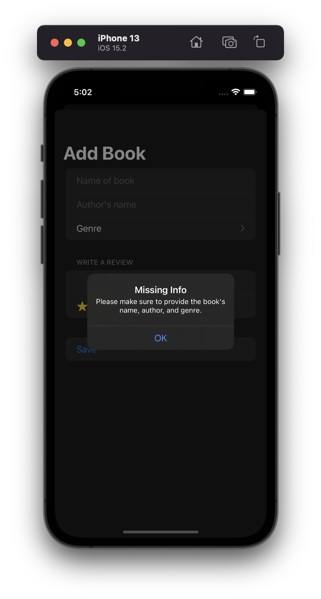

# Project 11 - Bookworm

This project includes solutions to the challenges.

## Challenges

1. Right now it’s possible to select no title, author, or genre for books, which causes a problem for the detail view. Please fix this, either by forcing defaults, validating the form, or showing a default picture for unknown genres – you can choose.
2. Modify `ContentView` so that books rated as 1 star are highlighted somehow, such as having their name shown in red.
3. Add a new “date” attribute to the Book entity, assigning `Date.now` to it so it gets the current date and time, then format that nicely somewhere in `DetailView`.

## Screenshots

### Light Mode

    
    
    
    
    
    

### Dark Mode

    
    
    
    
    
    

