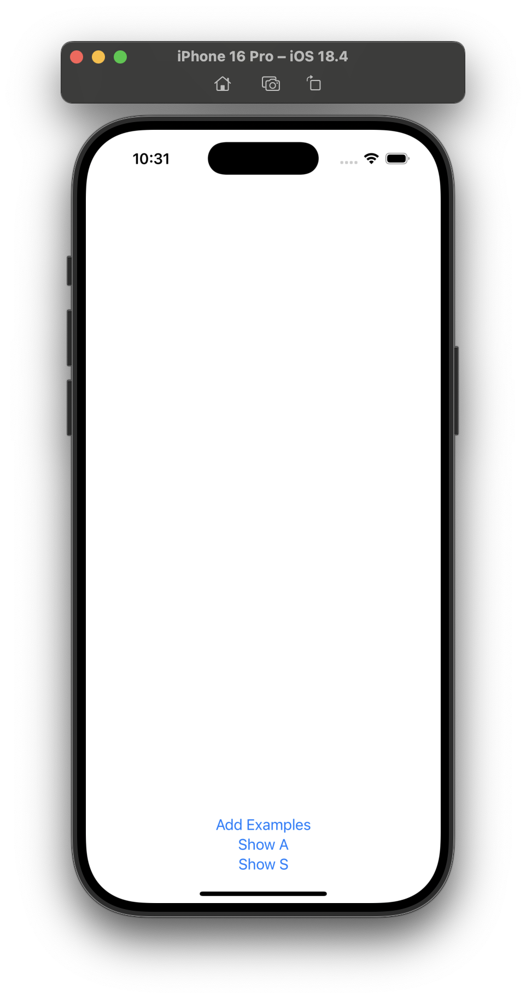
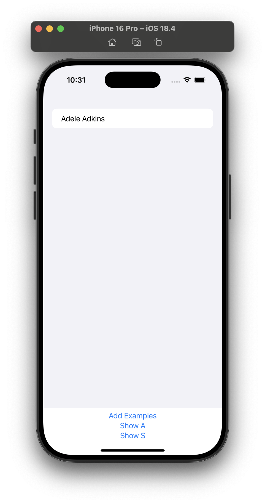
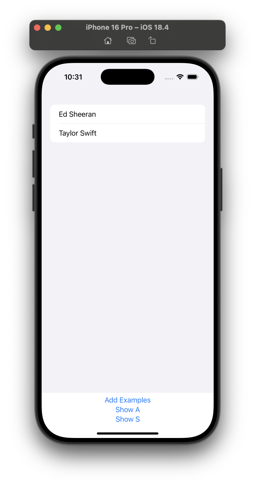
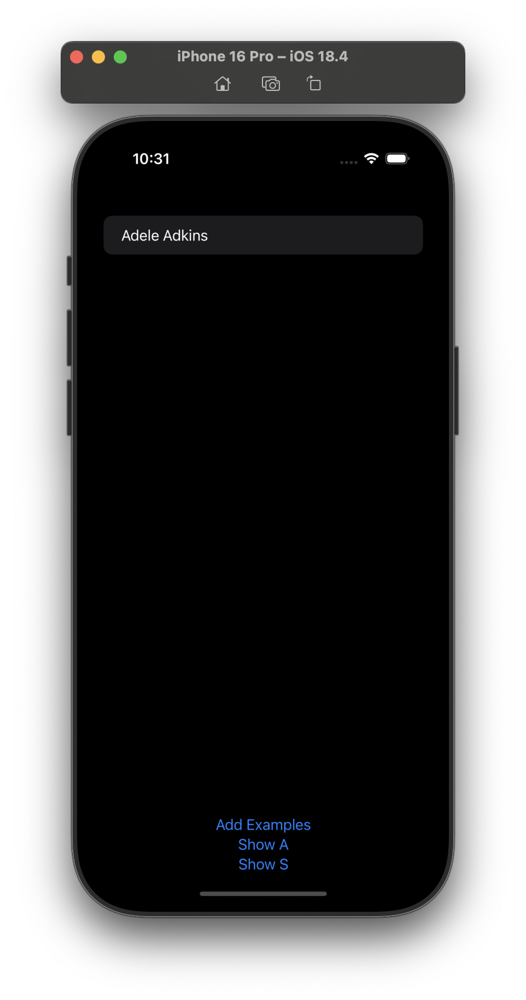
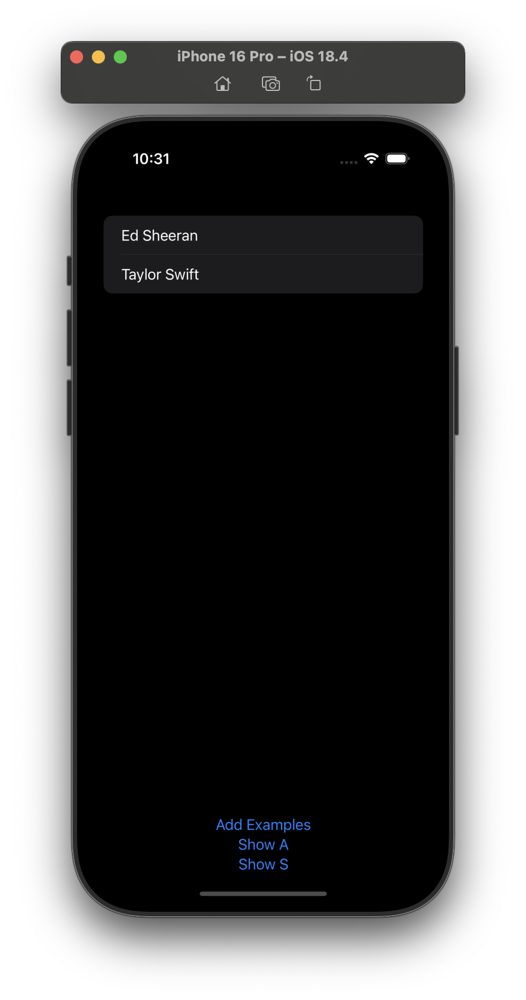

# Project 12 - CoreDataProject

## Challenges

<!-- prettier-ignore -->
| Challenge | Status |
| --- | :---: |
| 1. Make it accept a string parameter that controls which predicate is applied. You can use Swift’s string interpolation to place this in the predicate. | ✅ |
| 2. Modify the predicate string parameter to be an enum such as `.beginsWith`, then make that enum get resolved to a string inside the initializer. | ✅ |
| 3. Make `FilteredList` accept an array of `SortDescriptor` objects to get used in its fetch request. | ✅ |

## Screenshots

### Light Mode

  
  
  

### Dark Mode

  
  
  

