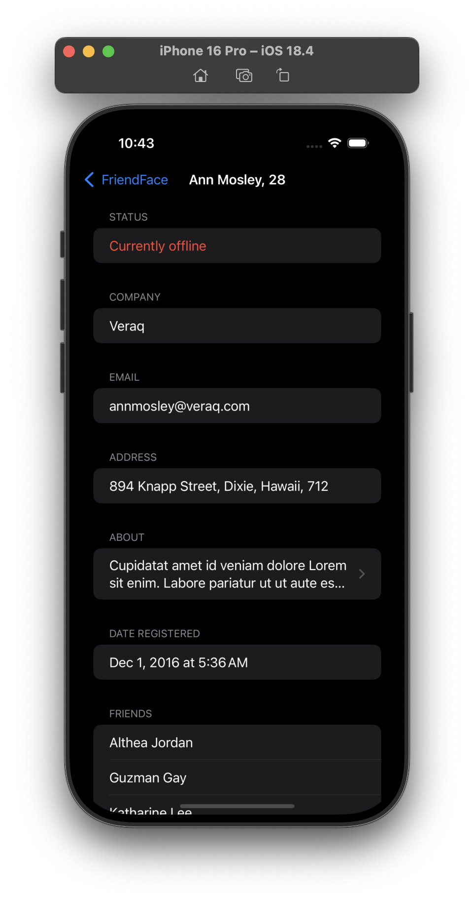

# Milestone Project - FriendFace (Projects 10-12)

## Part One (Day 60) - Fetching JSON

> It’s time for you to build an app from scratch, and it’s a particularly expansive challenge today: your job is to use URLSession to download some JSON from the internet, use Codable to convert it to Swift types, then use NavigationView, List, and more to display it to the user.
>
> ...
>
> How far you implement this is down to you, but at the very least you should:

<!-- prettier-ignore -->
| Challenge | Status |
| --- | :---: |
| 1. Fetch the data and parse it into User and Friend structs. | ✅ |
| 2. Display a list of users with a little information about them, such as their name and whether they are active right now. | ✅ |
| 3. Create a detail view shown when a user is tapped, presenting more information about them, including the names of their friends. | ✅ |
| 4. Before you start your download, check that your User array is empty so that you don’t keep starting the download every time the view is shown. | ✅ |

## Part Two (Day 61) - Adding Core Data

> Yes, your job today is to expand your app so that it uses Core Data. Your boss just emailed you to say the app is great, but once the JSON has been fetched they really want it to work offline. This means you need to use Core Data to store the information you download, then use your Core Data entities to display the views you designed – you should only need to fetch the data once. You still need to try to fetch the data every time your app loads, just in case it has changed somehow, but if that fetch fails it’s okay because you still have your Core Data back up.

## Screenshots

### Light Mode

  
  
  
  

### Dark Mode

  
  
  
  

