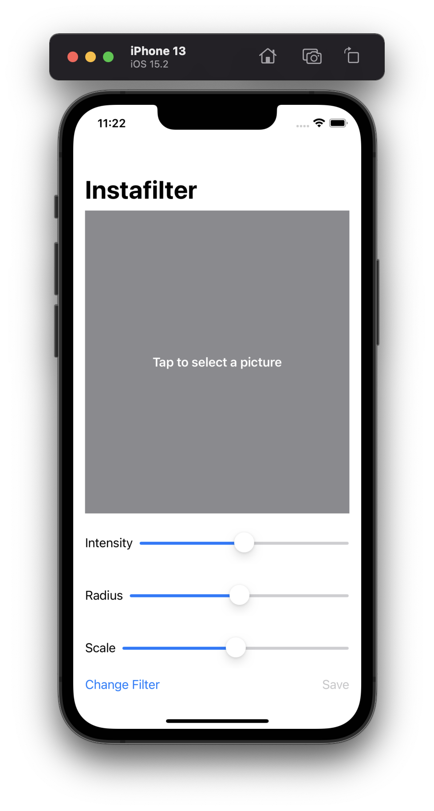
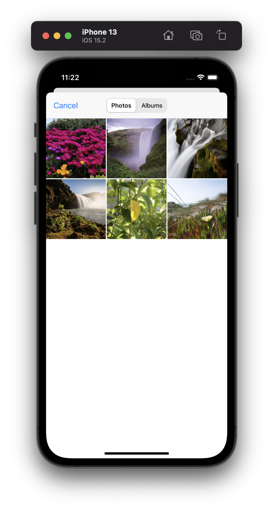
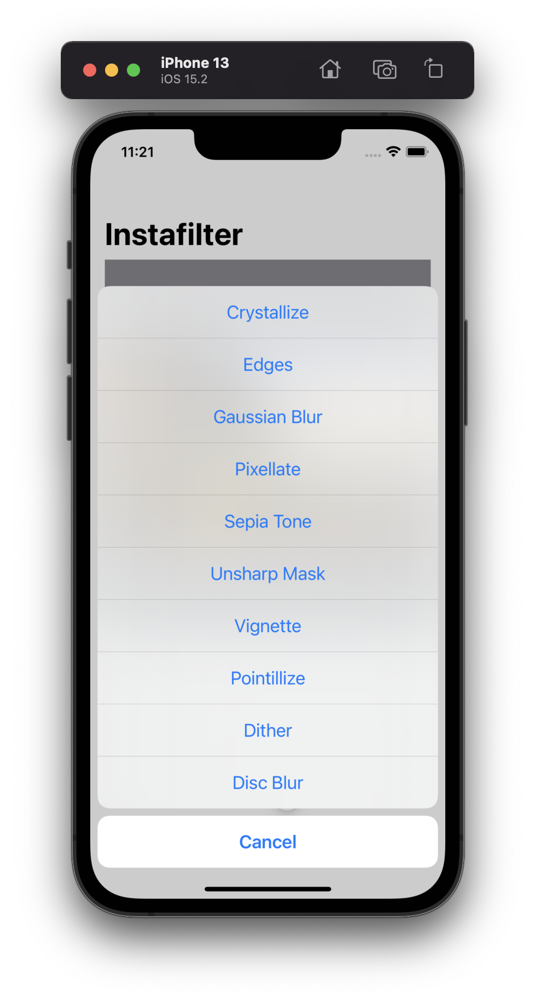
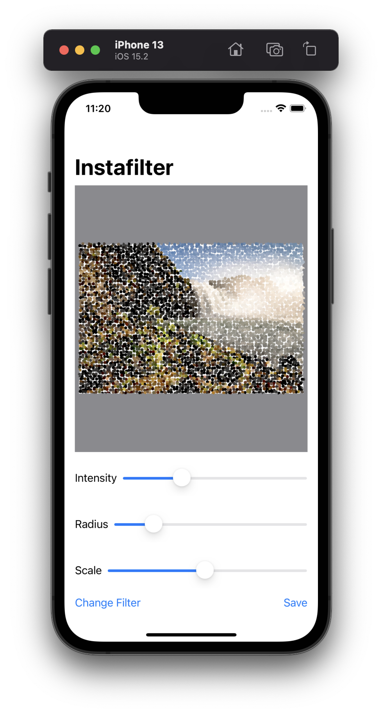
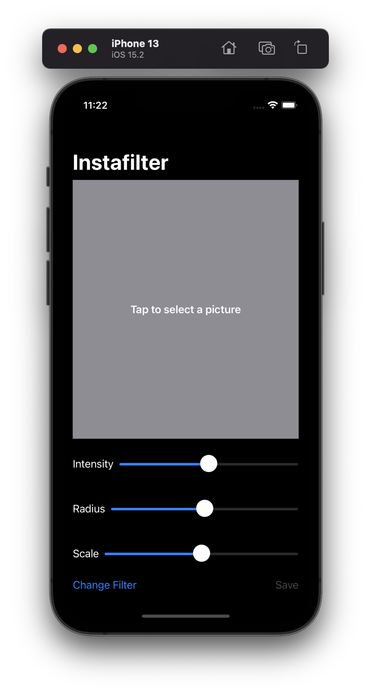
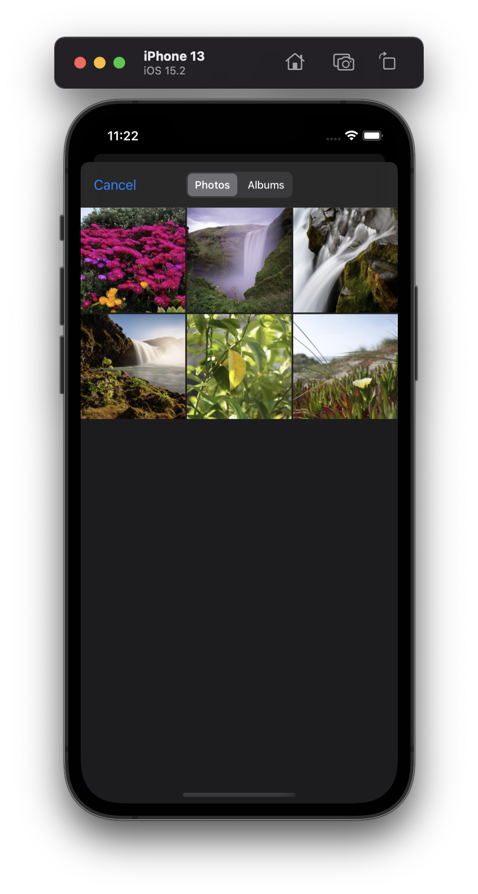
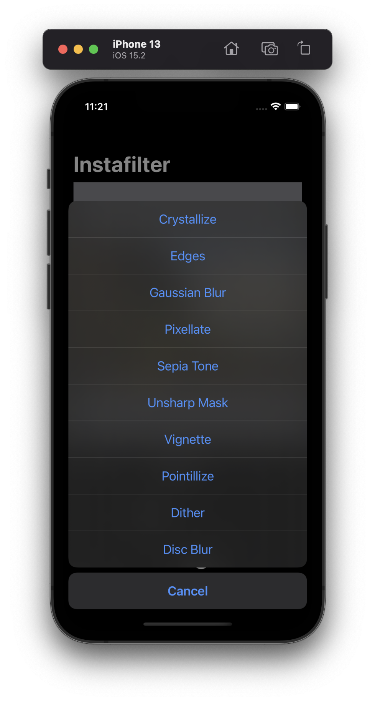
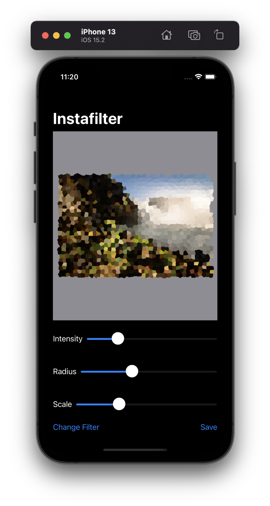
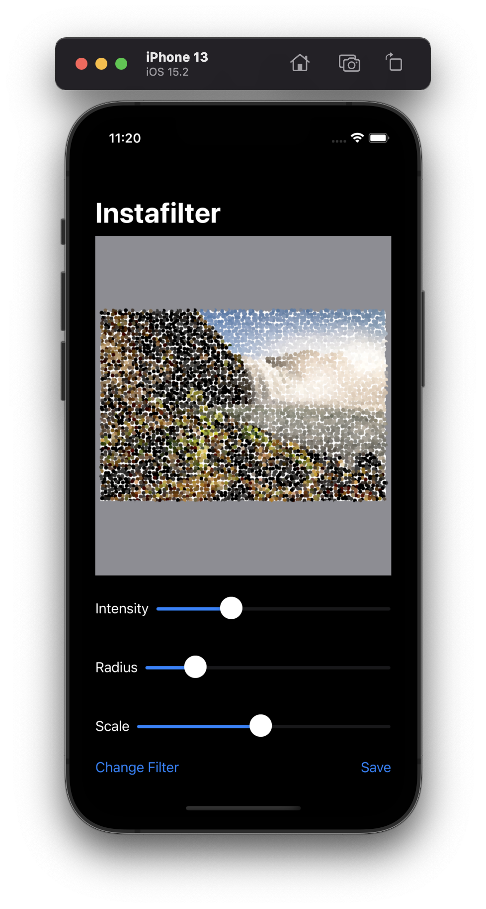

# Project 13 - Instafilter

This project includes solutions to the challenges.

## Challenges

1. Try making the Save button disabled if there is no image in the image view.
2. Experiment with having more than one slider, to control each of the input keys you care about. For example, you might have one for radius and one for intensity.
3. Explore the range of available Core Image filters, and add any three of your choosing to the app.

## Screenshots

### Light Mode

  
  
  
  
  

### Dark Mode

  
  
  
  
  

