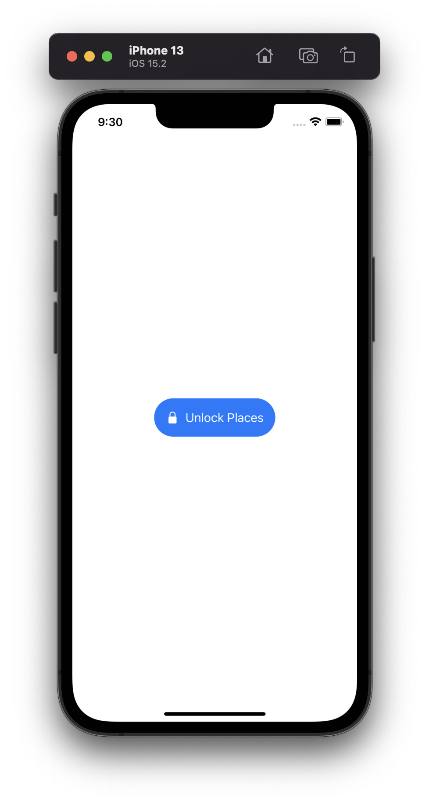
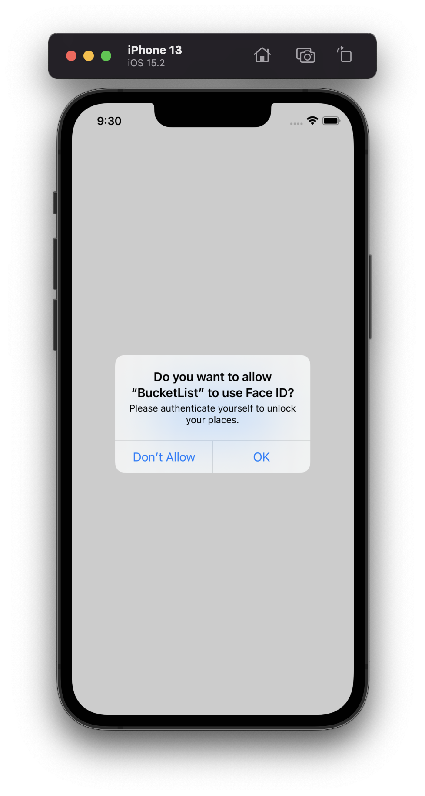
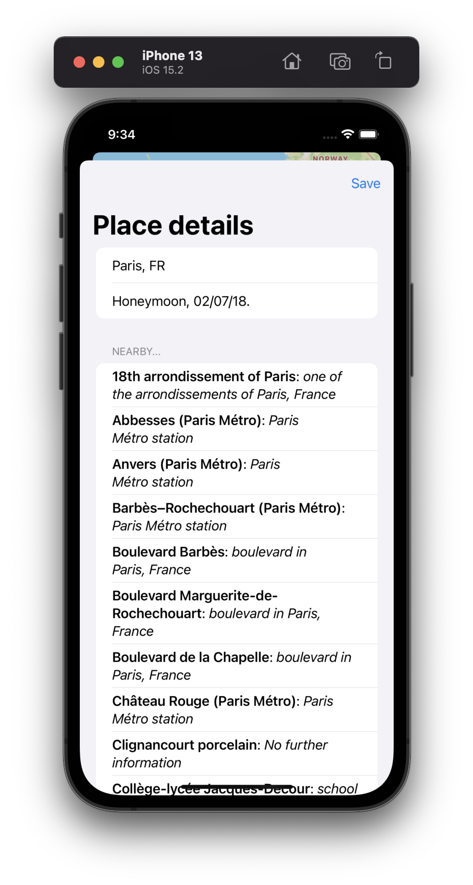
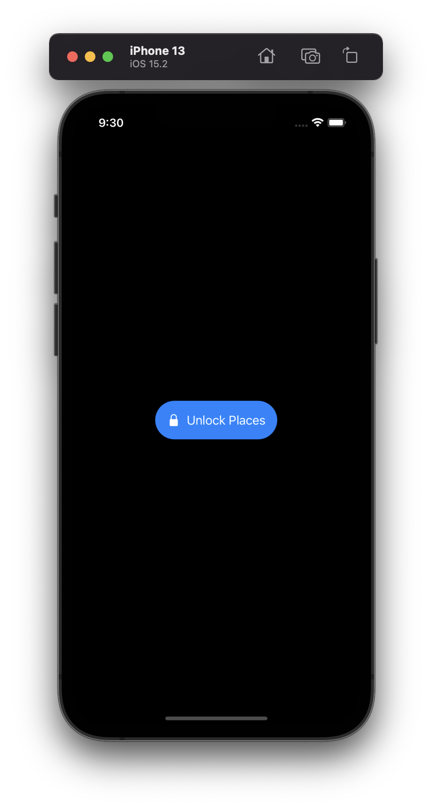
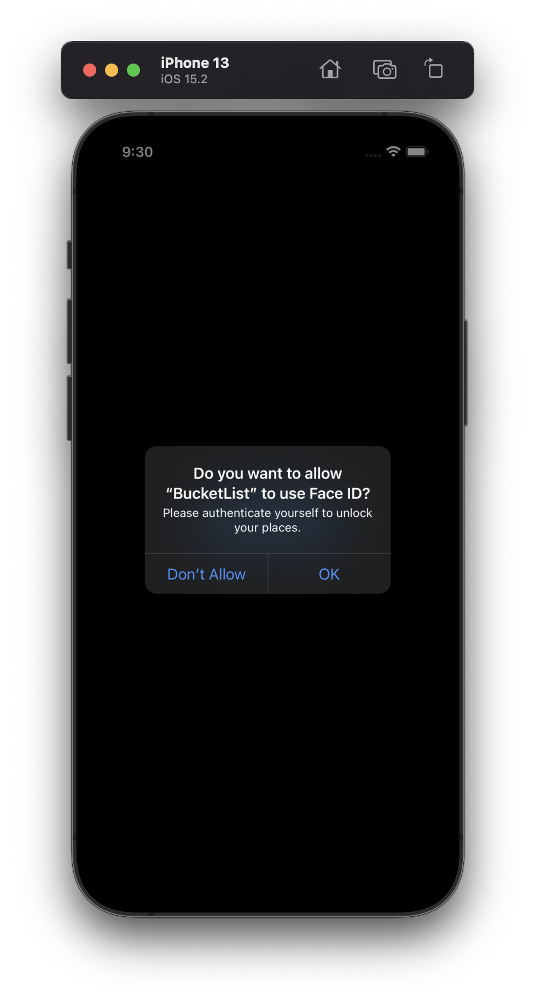
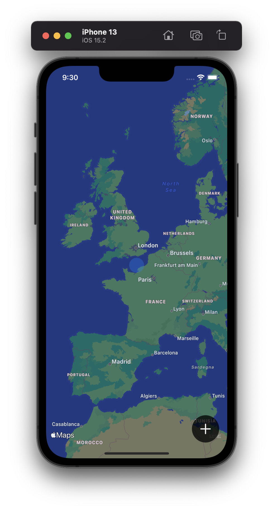
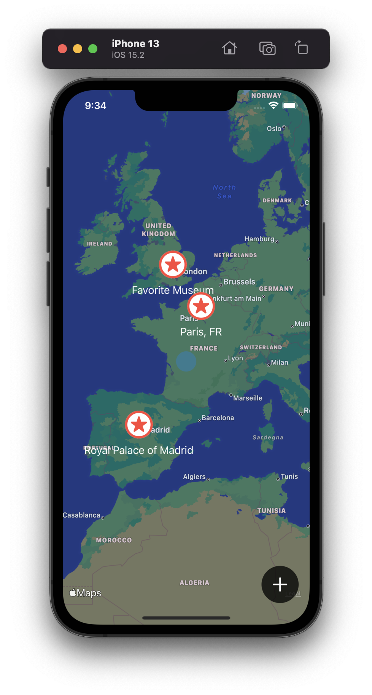
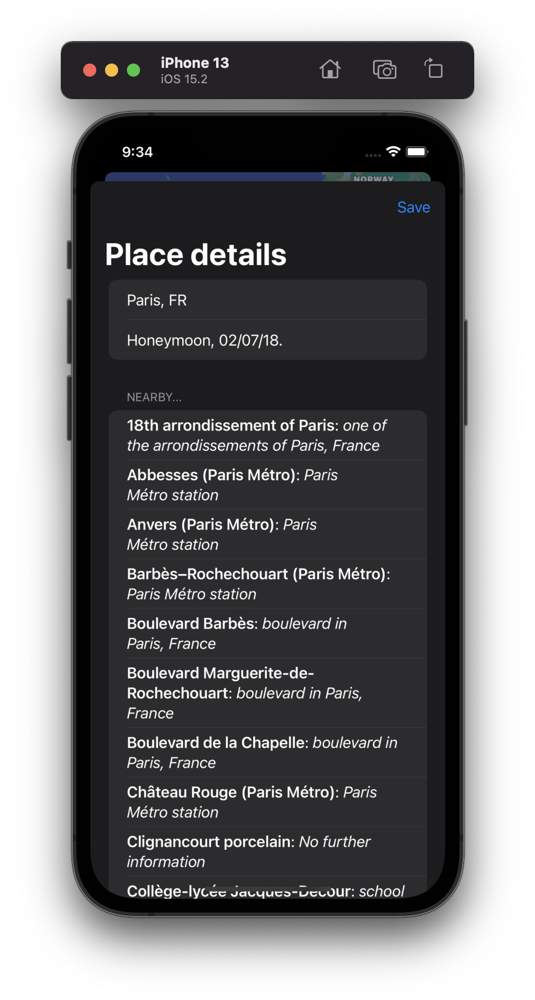

# Project 14 - BucketList

This project includes solutions to the challenges.

## Challenges

1. Our + button is rather hard to tap. Try moving all its modifiers to the image inside the button – what difference does it make, and can you think why?
2. Our app silently fails when errors occur during biometric authentication, so add code to show those errors in an alert.
3. Create another view model, this time for `EditView`. What you put in the view model is down to you, but I would recommend leaving `dismiss` and `onSave` in the view itself – the former uses the environment, which can only be read by the view, and the latter doesn’t really add anything when moved into the model.

## Screenshots

### Light Mode

  
  
  
  
  

### Dark Mode

