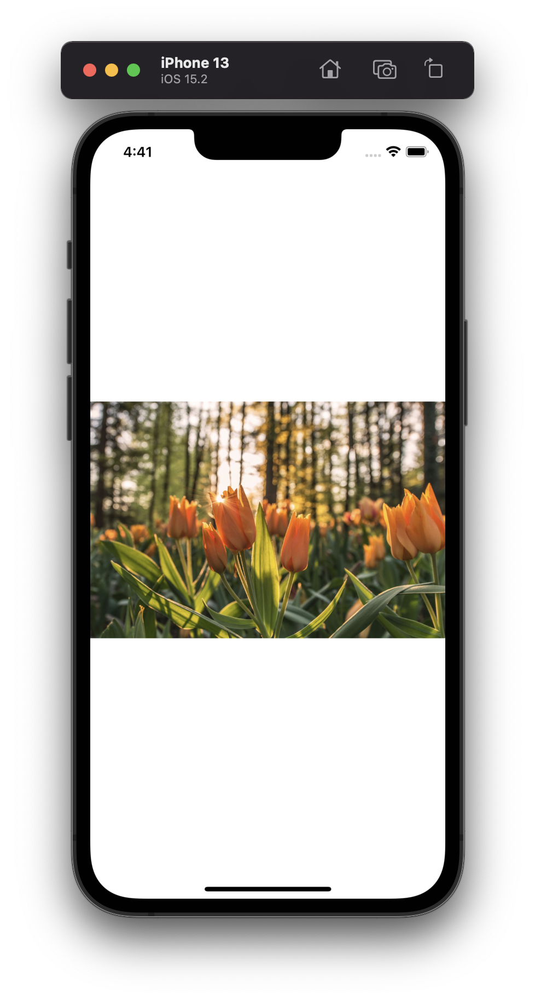
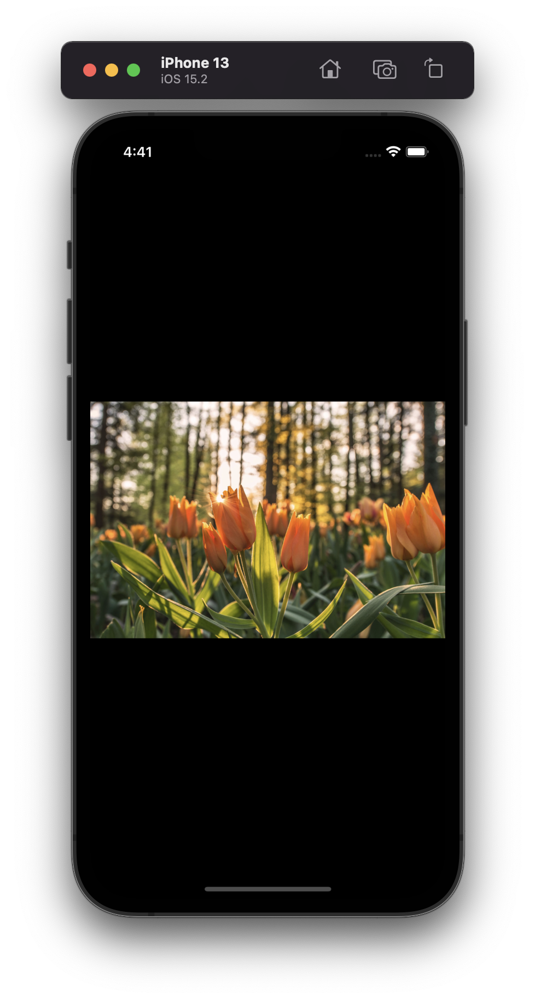

# Project 15 - Accessibility App

This project includes solutions to the challenges.

## Challenges

1. The check out view in [Cupcake Corner](../14-Project-10-CupcakeCorner) uses an image and loading spinner that don’t add anything to the UI, so find a way to make the screenreader not read them out.
2. Fix the list rows in [iExpense](../10-Project-7-iExpense) so they read out the name and value in one single VoiceOver label, and their type in a hint.
3. Do a full accessibility review of [Moonshot](../11-Project-8-Moonshot) – what changes do you need to make so that it’s fully accessible?

## Screenshots

### Light Mode

  

### Dark Mode

  

