# Milestone Project - Remember Them (Projects 13-15)

## Part 1 (Day 77) - Base Project

<blockquote>
Have you ever been to a conference or a meetup, chatted to someone new, then realized seconds after you walk away that you’ve already forgotten their name? You’re not alone, and the app you’re building today will help solve that problem and others like it.

  
Your goal is to build an app that asks users to import a picture from their photo library, then attach a name to whatever they imported. The full collection of pictures they name should be shown in a `List`, and tapping an item in the list should show a detail screen with a larger version of the picture.
</blockquote>

## Part 2 (Day 78) - Adding MapKit

<blockquote>
Yesterday you built a new app that imports photos from the user’s library, and hopefully you’re pleased with the finished product – or at least making great progress towards the finished product.

  
But your boss has come in and demanded a new feature: when you’re viewing a picture that was imported, you should show a map with a pin that marks where they were when that picture was added. It might be on the same screen side by side with the photo, it might be shown or hidden using a segmented control, or perhaps it’s on a different screen – it’s down to you. Regardless, you know how to drop pins, and you also know how to use the center coordinate of map views, so the only thing left to figure out is how to get the user’s location to save alongside their text and image.
</blockquote>

## Screenshots

### Light Mode

  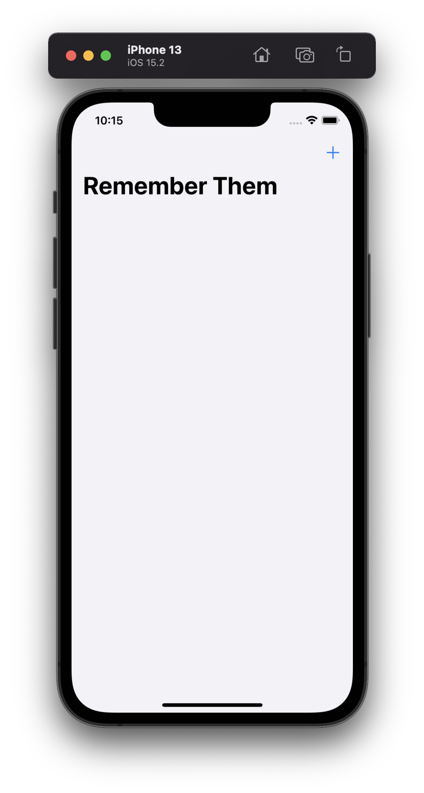
  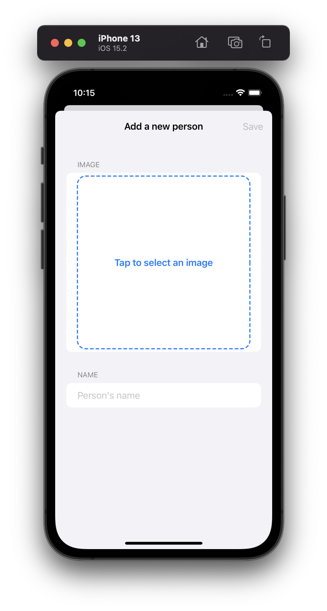
  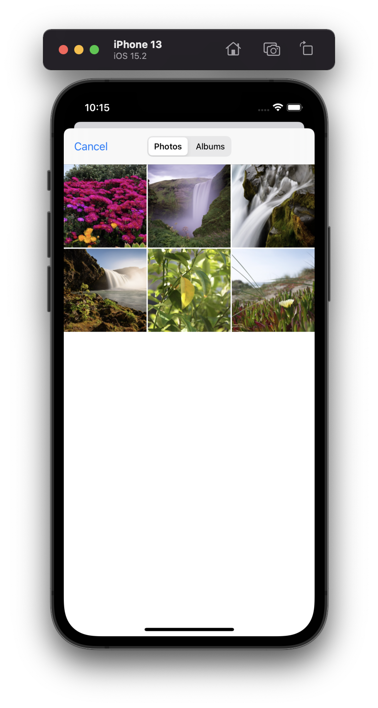
  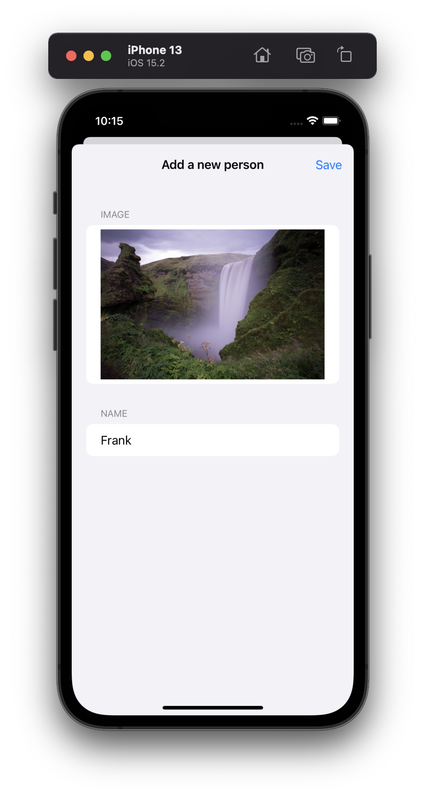
  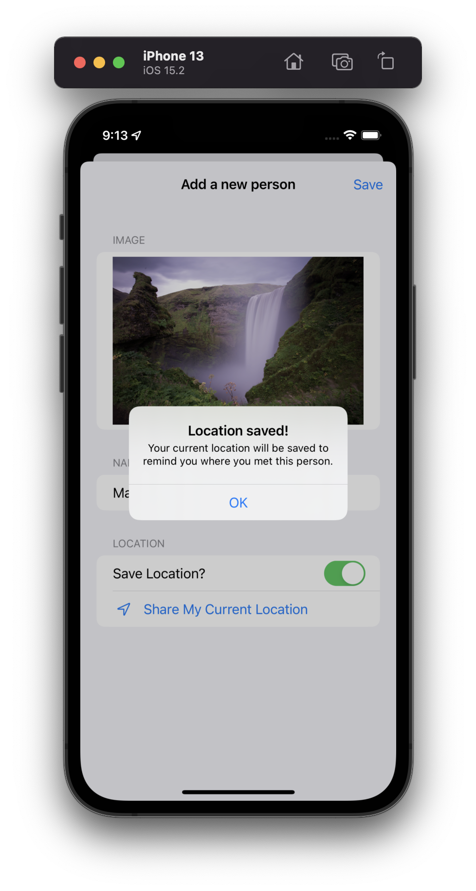
  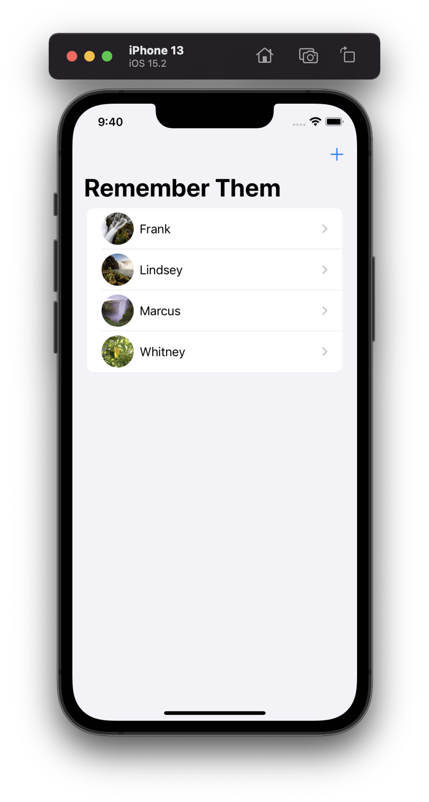
  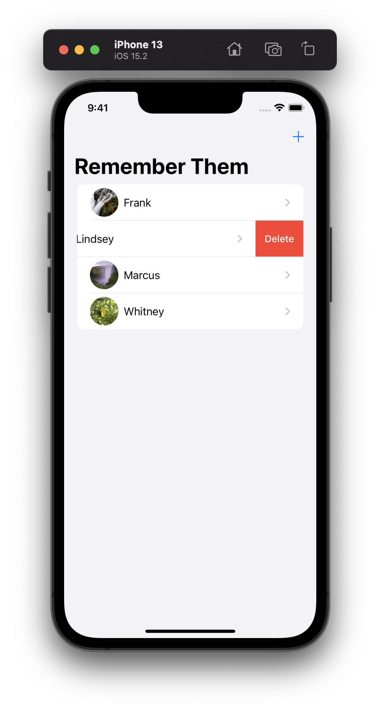
  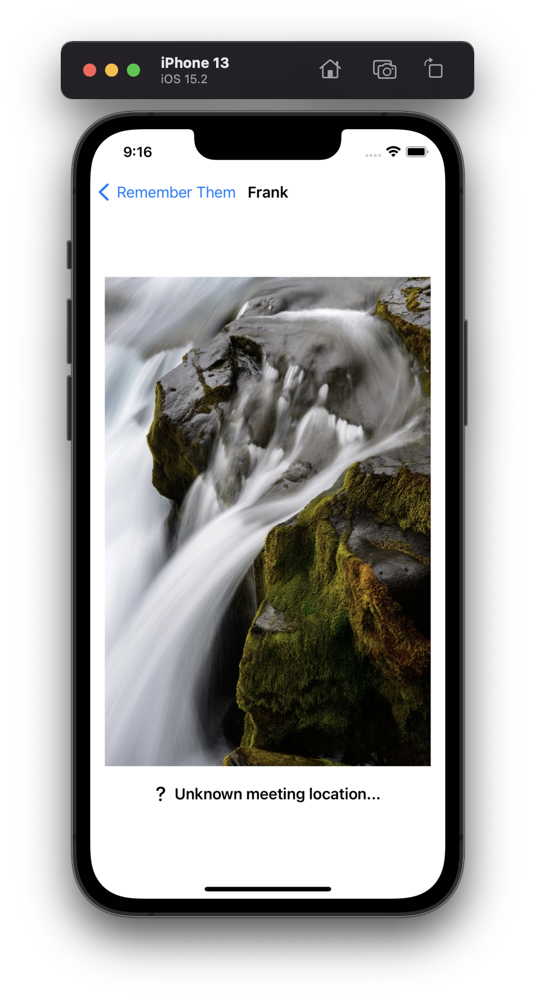
  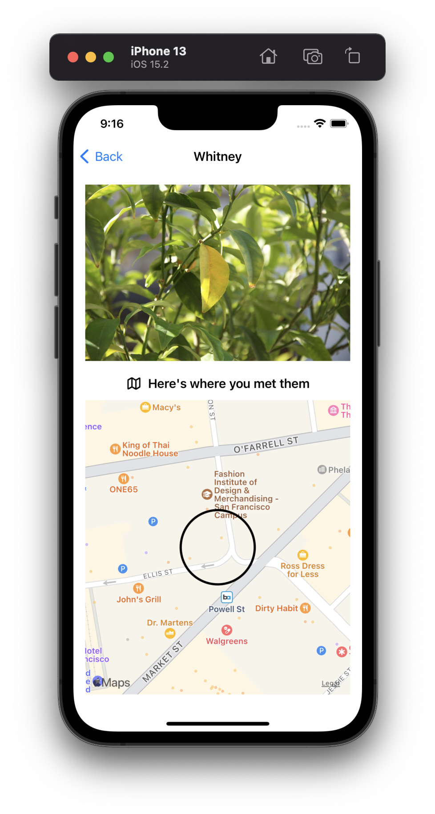

### Dark Mode

  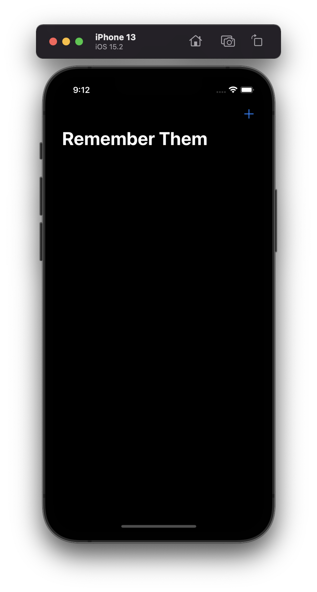
  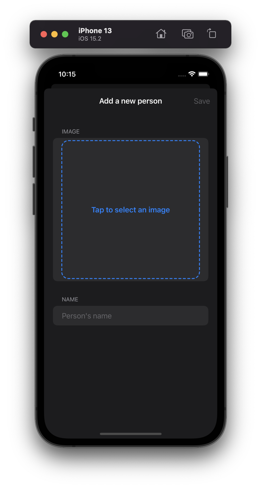
  
  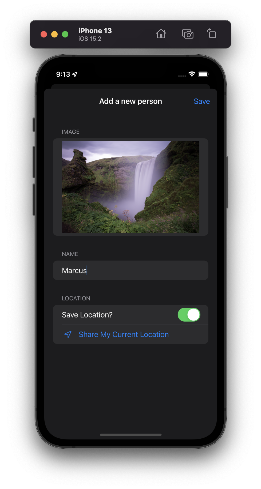
  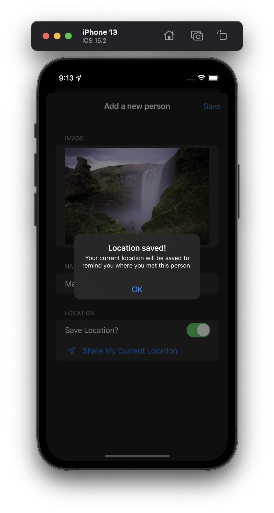
  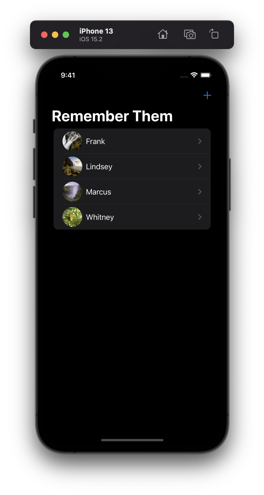
  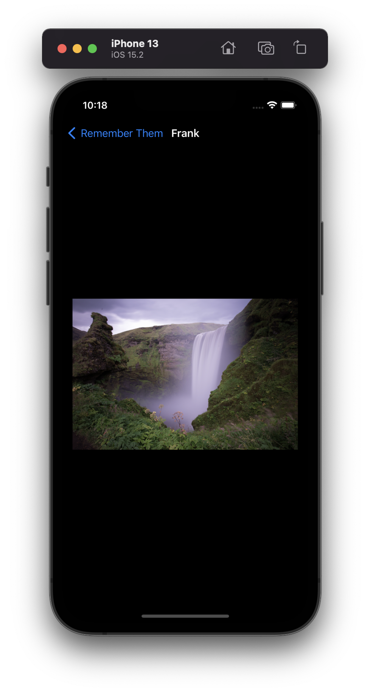
  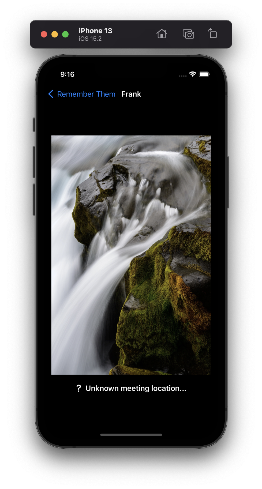
  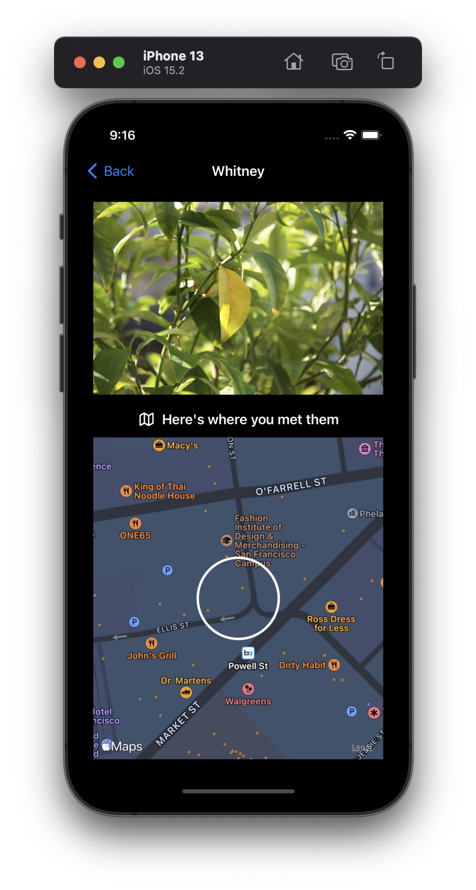

