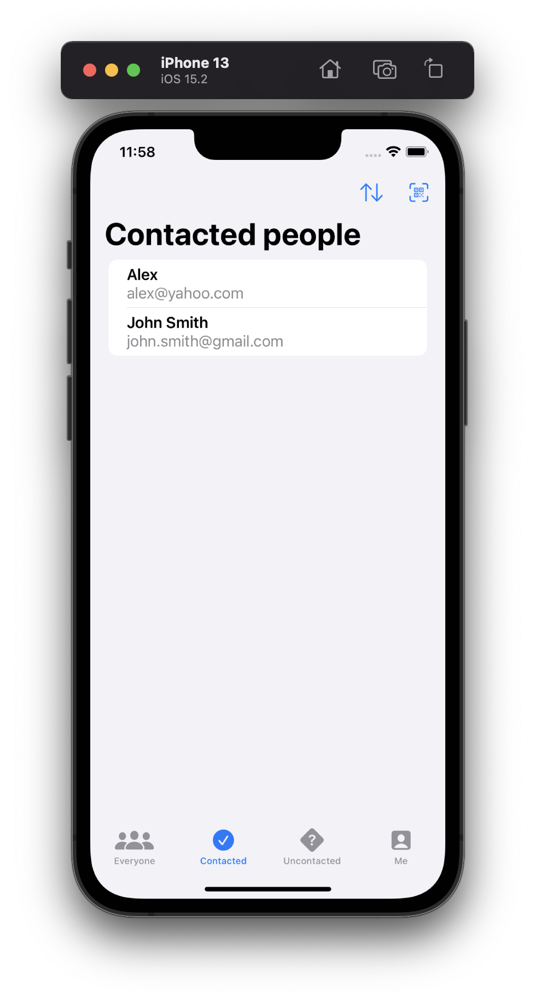
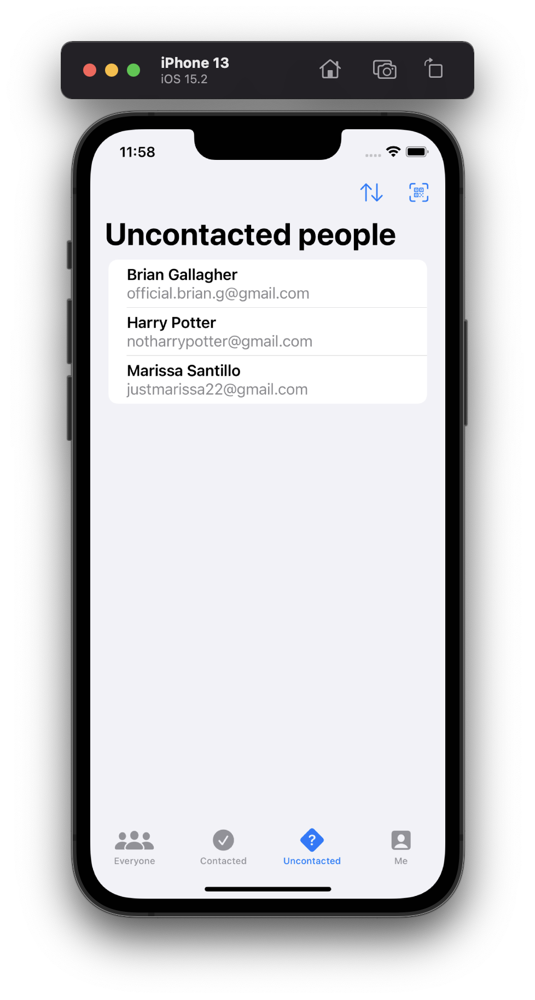
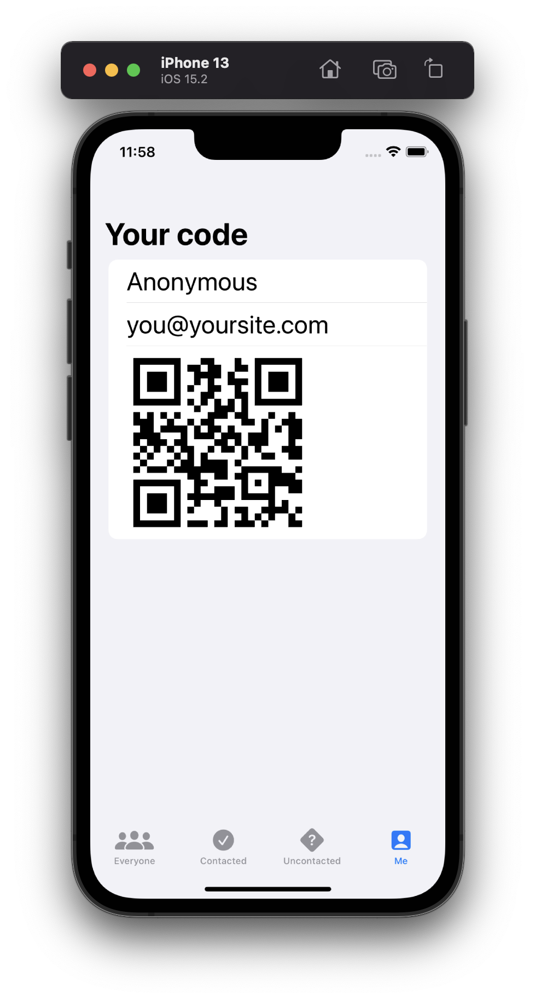
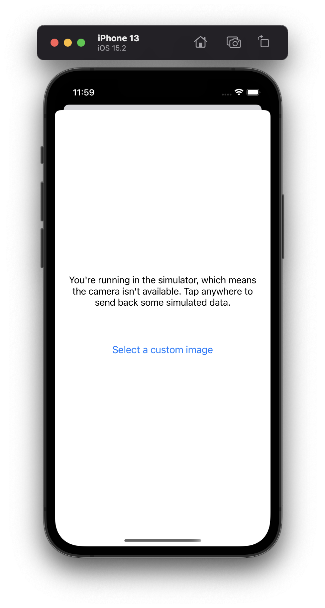
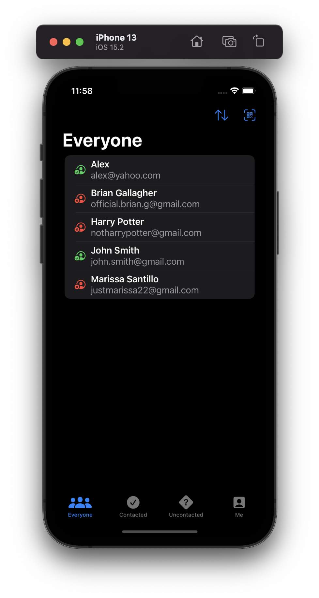
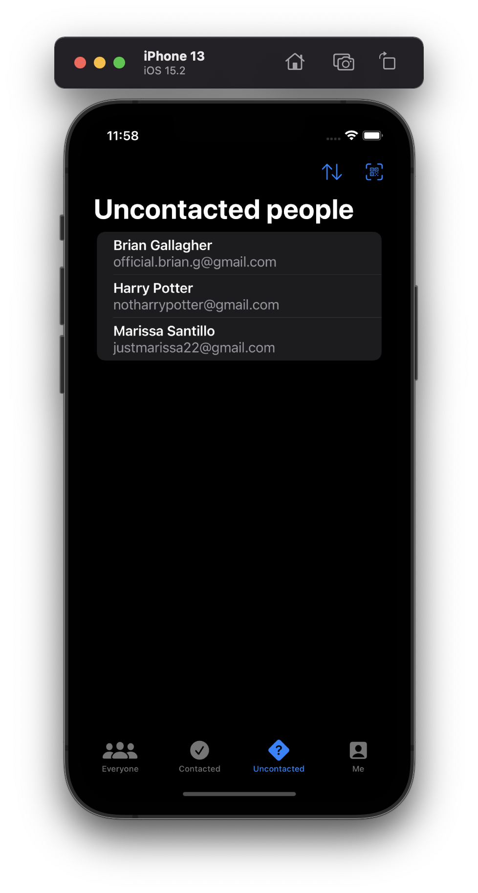
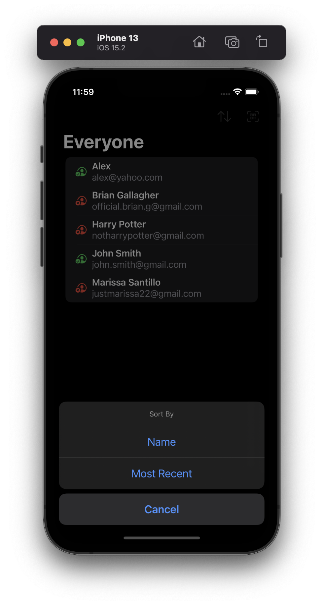
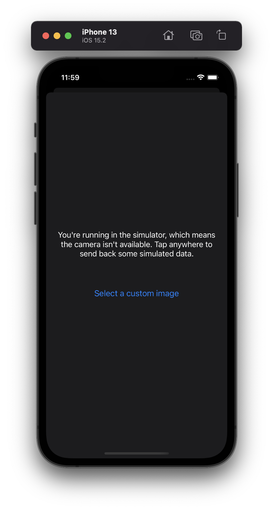

# Project 16 - Hot Prospects

This project includes solutions to the challenges.

## Challenges

1. Add an icon to the “Everyone” screen showing whether a prospect was contacted or not.
2. Use JSON and the documents directory for saving and loading our user data.
3. Use a confirmation dialog to customize the way users are sorted in each tab – by name or by most recent.

## Screenshots

### Light Mode

### Dark Mode

