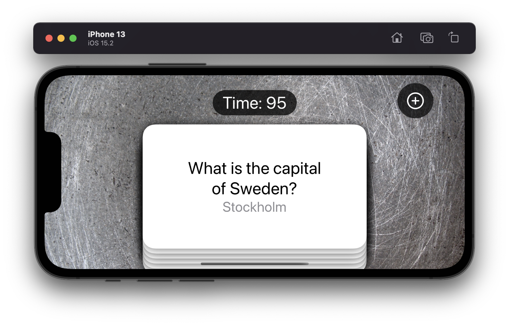
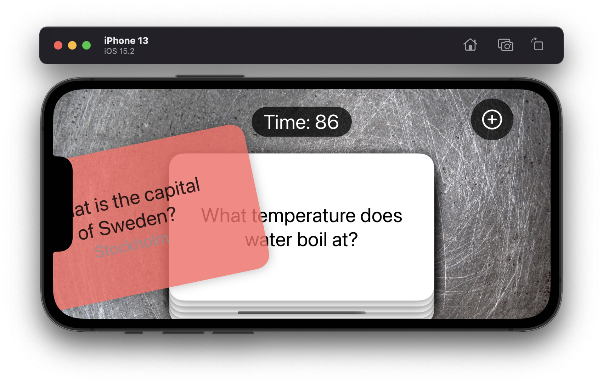
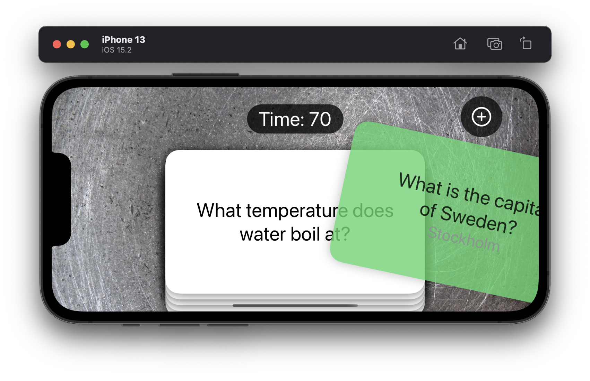
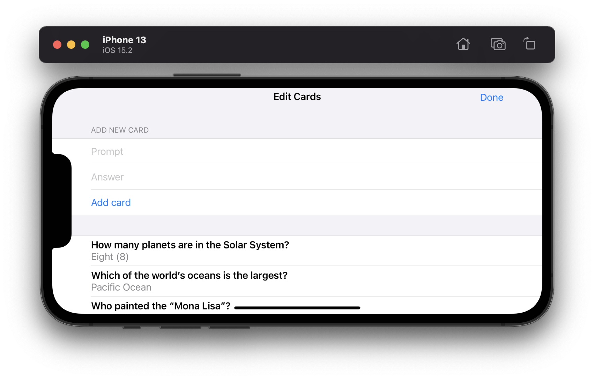
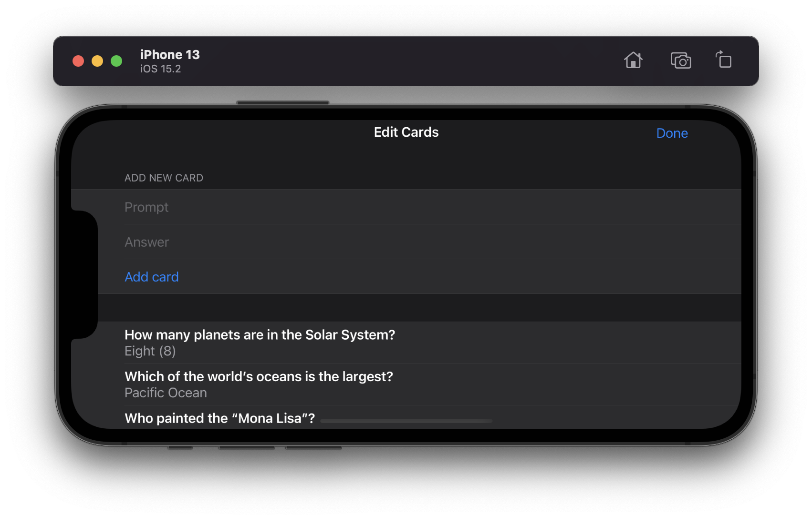

# Project 17 - Flashzilla

This project includes solutions to the challenges.

## Challenges

1. When adding a card, the textfields keep their current text – fix that so that the textfields clear themselves after a card is added.
2. If you drag a card to the right but not far enough to remove it, then release, you see it turn red as it slides back to the center. Why does this happen and how can you fix it? (Tip: think about the way we set `offset` back to 0 immediately, even though the card hasn’t animated yet. You might solve this with a ternary within a ternary, but a custom modifier will be cleaner.)
3. ~*For a harder challenge: when the users gets an answer wrong, add that card goes back into the array so the user can try it again. Doing this successfully means rethinking the `ForEach` loop, because relying on simple integers isn’t enough – your cards need to be uniquely identifiable.*~

## Screenshots

### Light Mode & Dark Mode

  
  
  
  
  
  
  

### Light Mode (Difference)

  

### Dark Mode (Difference)

  

