# Project 19 - SnowSeeker

This project includes solutions to the challenges.

## Challenges

1. Add a photo credit over the `ResortView` image. The data is already loaded from the JSON for this purpose, so you just need to make it look good in the UI.
2. Fill in the loading and saving methods for `Favorites`.
3. For a real challenge, let the user sort the resorts in `ContentView` either using the default order, alphabetical order, or country order.

## Screenshots

### Light Mode

#### iPhone 13

  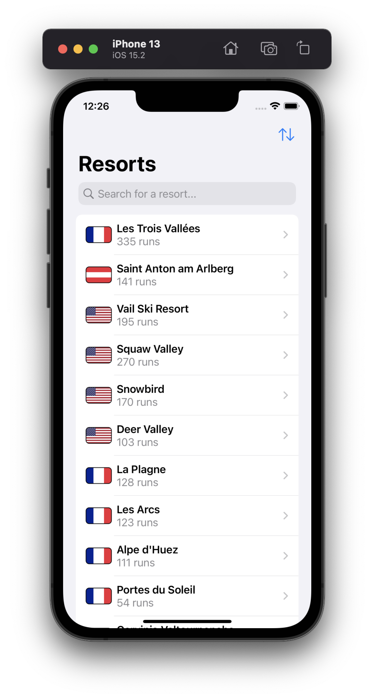
  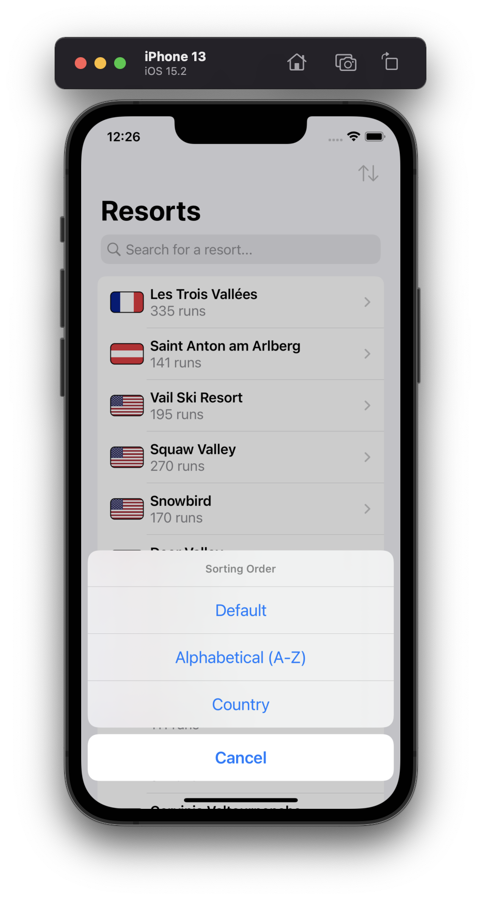
  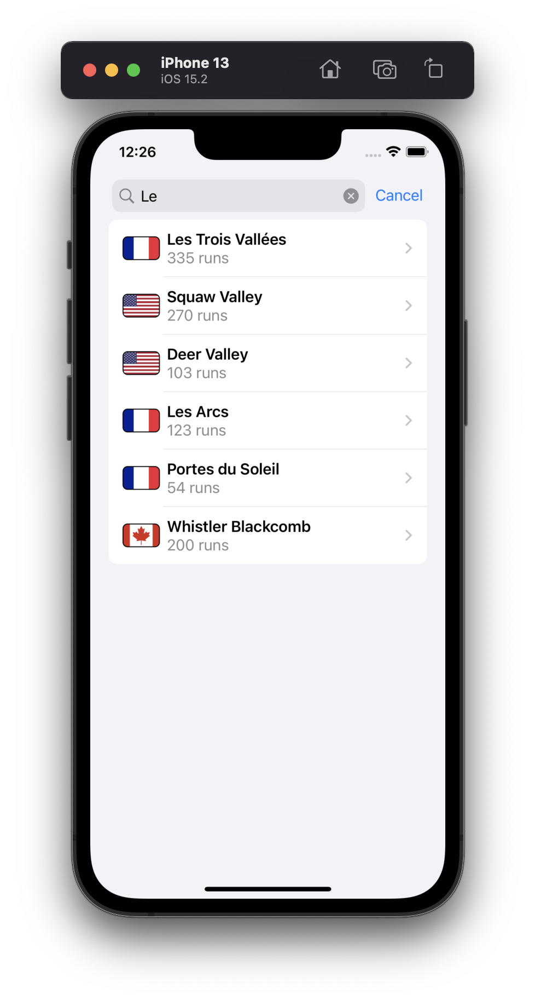
  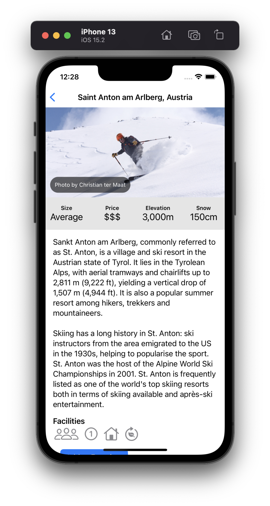
  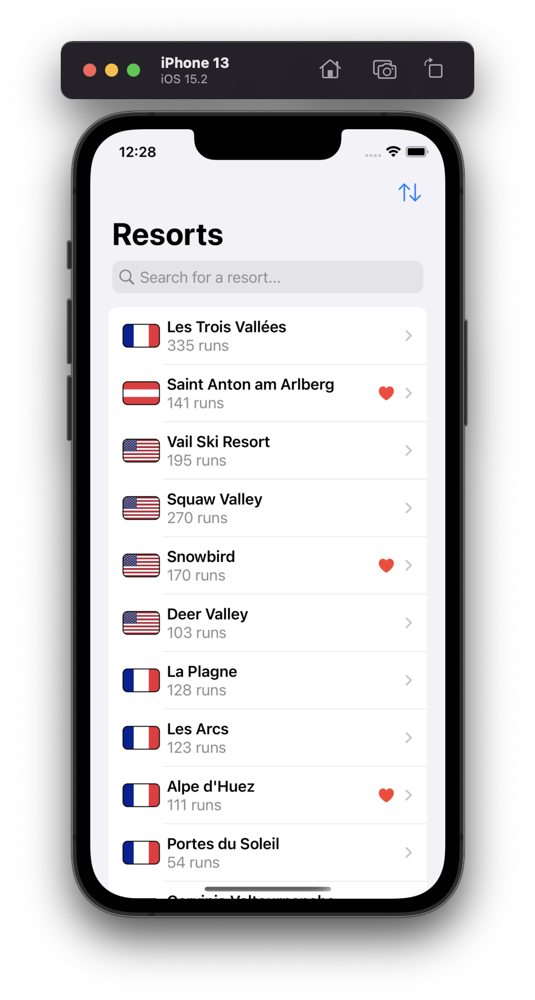
  

#### iPad Pro (12.9-inch)

  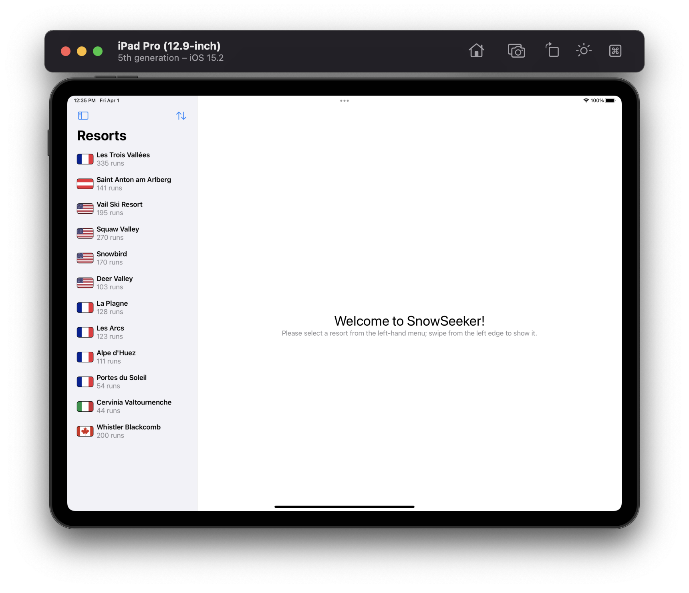
  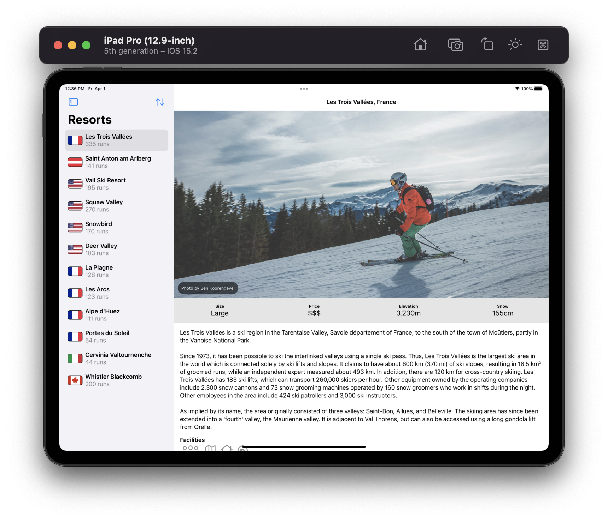

### Dark Mode

#### iPhone 13

  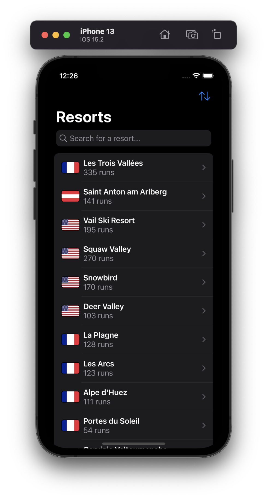
  
  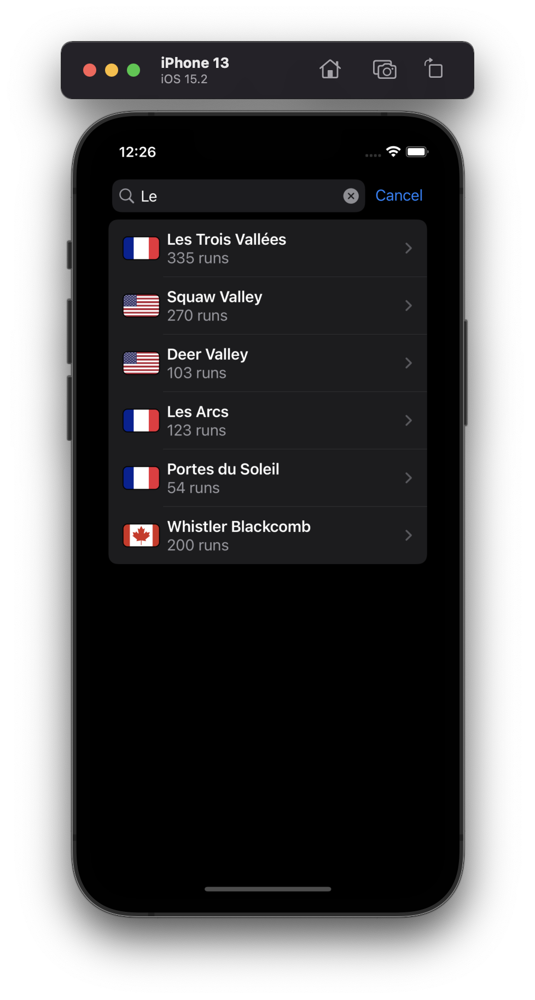
  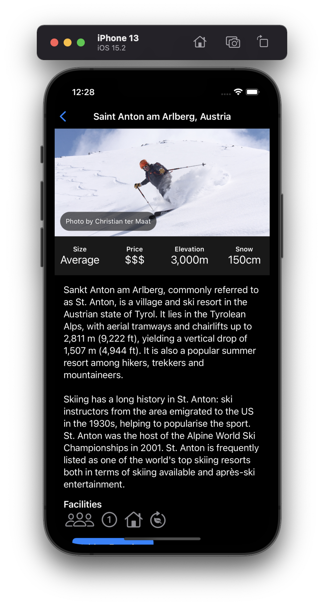
  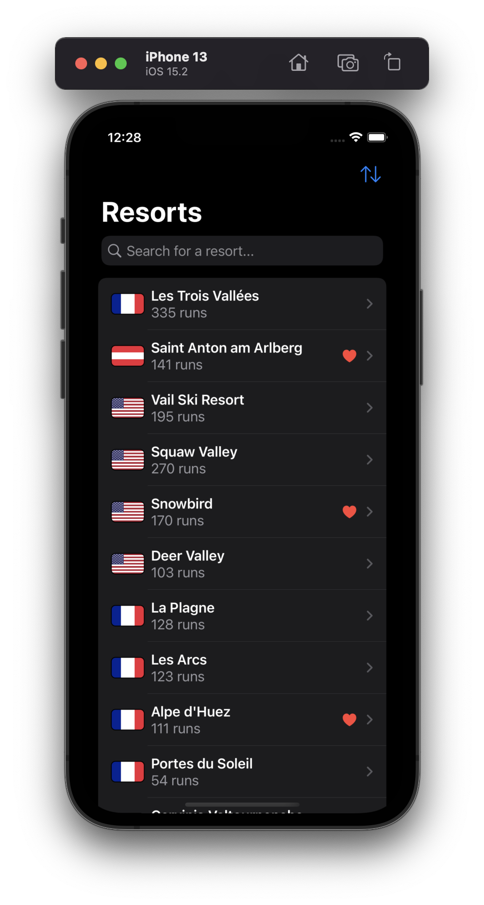
  

#### iPad Pro (12.9-inch)

  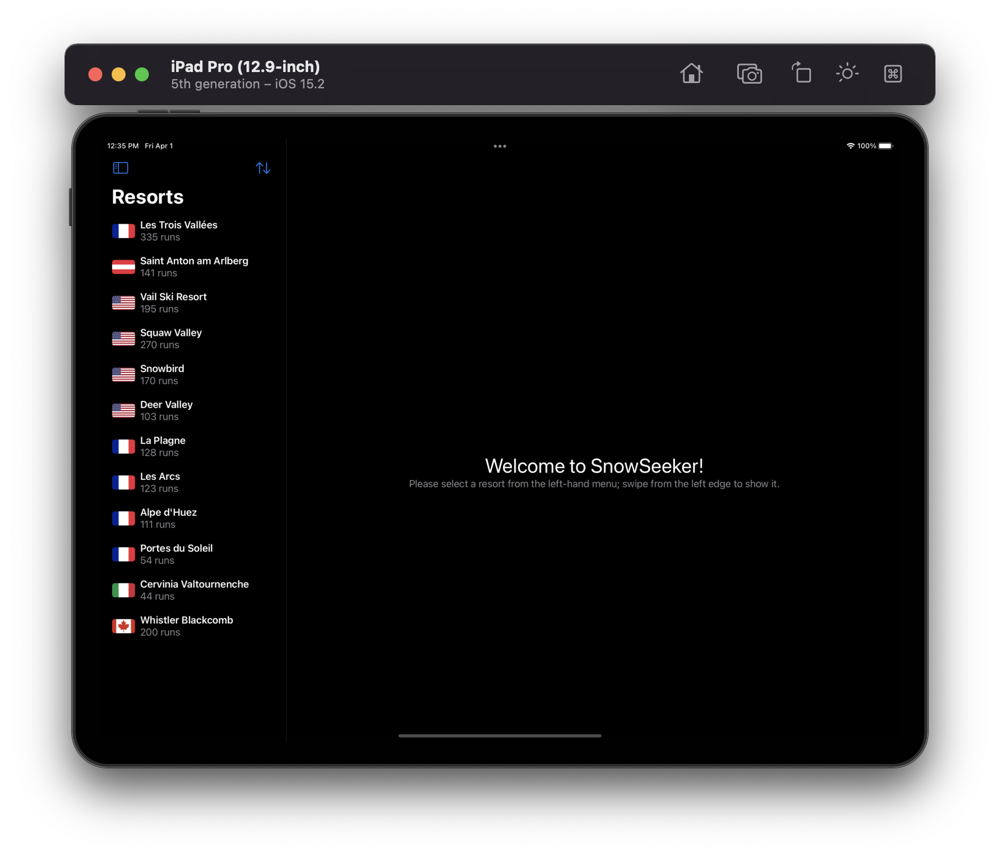
  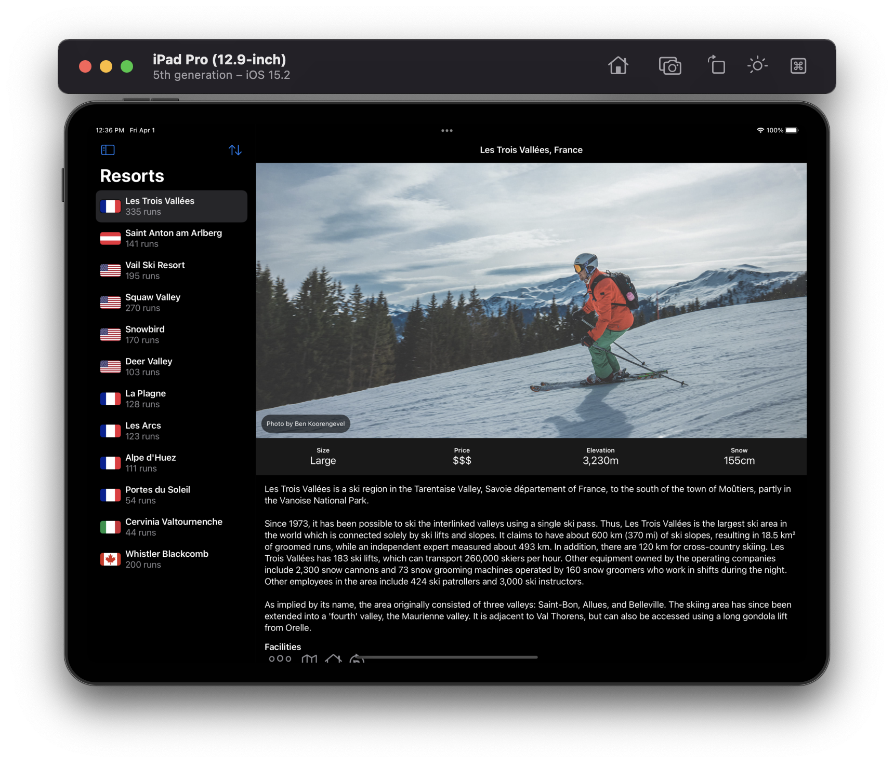

